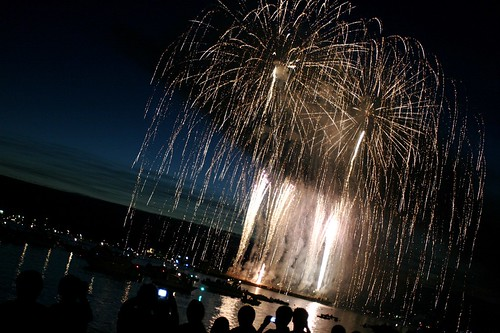
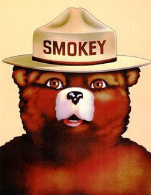

So, I don’t want to be known as a party pooper, but as I was sitting here in my bed, looking at live web cams of Vancouver’s Celebration of Light, it suddenly occurred to me that shooting off fireworks into the sky when there’s essentially a province wide fire ban on doesn’t strike me as a particularly bright idea.

Sure, it brings people together. And I understand not only the amount of planning that goes into the event, but also how hard they would be to postpone or call off. But it seems strange (and obviously hypocritical) that all of us little people are told not to light any fires (campfires, open flame, pyrotechnics), but the Celebration of Light can go ahead and light off several thousand explosions right in the vicinity of one of North America’s largest urban parks, [Stanley Park](http://en.wikipedia.org/wiki/Stanley_Park).

Ultimately, I don’t really care, but it does strike me as odd. I went searching for some official verbiage regarding the fire ban, and eventually found [this](http://bcwildfire.ca/hprScripts/WildfireNews/DisplayBan.asp?ID=254#OpenFireBans):

> Effective noon on July 28, 2009 and until further notice a campfire ban is in effect throughout the entire Coastal Fire Centre, including the Bella Coola valley.
> 
> Campfires are only permitted on the outer west coast of Vancouver Island from the ocean to two kilometres inland of the high water mark from Port Hardy north to Cape Scott, and southward on the west coast of Vancouver Island to Port Renfrew. This ban does not restrict fires in stoves using gas, propane, or briquettes. This restriction does apply to open flame campfire apparatus (i.e. propane campfires, etc.)
> 
> The public is further reminded that fireworks and pyrotechnics are also restricted throughout the Coastal Fire Centre. Exemptions for the use of fireworks for special events may be considered on a case by case basis.

I suspect that last little blurb was tossed in their specifically for the Celebration of Light, but who knows.

Just remember what Smokey the Bear says kids, open flame is bad, so is burning leaves, but if you have a truckload of fireworks, that’s ok — you can set them all off, just make sure you have an insane amount of firetrucks on standby, or someone is paying you big bucks.

Only you can prevent forest fires.