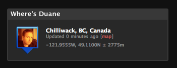

Just for yucks, I integrated Google Latitude into the sidebar in [my blog section](/blog/). Google latitude, for those that don’t know, allows people with GPS-enabled devices to share their locations with their friends (I think it can do it based on geo-IP as well, but that’s not super exciting IMO). I’m not entirely sure showing a map with all my friends on it is particularly useful to be honest, but I thought I’d toss my location up on there for something to do.

Far better, in my opinion, would be integration with services such as IM, such that I can see my friend’s list sorted by distance to me. That way if I wanted to go to the bar (and drink water, as per my last post), I could find a list of people close by and blast out a quick group message.

Some people are worried about privacy — I’m not really one of them. Back when I was a kid you could open up the phone book and find out the exact street address of every one of your friends, so I’m not really worried about sharing my location with an uncertainty of a few hundred meters on it.