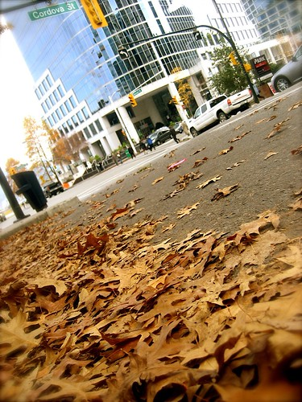

Yesterday I went down to Friday Harbor and hung out with my friend [Lynn](http://naffoff.blogspot.com). I hadn’t been to Friday Harbor since I was about 17 or so, so it was definitely cool to go back. There wasn’t as much there to do as I thought there would be, but Lynn and I managed to find a few watering holes to hang out in and observe the locals for a while. “Chap-man” pretty much took the weirdo cake, but there were lots of runners up. It was great catching up with Lynn again too, since we hadn’t had a chance to hang out for over two years now. In addition, the weather was nearly perfect, and reminded me of a nice warm autumn day.

I’ve come to realize these last few years that summer is probably my least favorite season. Sure, sitting up on the beach with a book or a beer is always a good time, and so is camping, but I’m not a huge fan of the heat, or all the hustle and bustle of travelers during the summer. Truthfully, as I’ve said before, autumn is probably my favorite season. It’s usually warm enough so you can still go outside in a t-shirt or a short-sleeved shirt, but cold enough that you probably want to wear jeans. The mornings are a tad cold, and so are the evenings, which makes doing an early evening walk with a coffee or a camera all the more refreshing I find. The sun starts going down earlier, and before you know it, it’s dark when you get home from work. And while I appreciate the the long days in the summer, I sure don’t mind all the movie nights that go along with the shorter days in the fall and winter.

I’m really looking forward to the little coffee shop opening up next to Cooper’s grocery store sometime soon. It’ll be a nice little escape during the day, a place where I can meander to with my laptop and camera during the fall, and do a little work from time to time. This little neighborhood is sure filling out, and soon I’m not going to need to hop in the car at all really.

I suspect we’ll still have a few more weeks of sunshine and warmth here. But most of the vegetables and fruits on my patio are ripe now, which sort of signals the end of summer to me. In a few more weeks I’ll be hopping on a plane (or possible driving, haven’t quite decided yet) and heading down to Portland for a WordCamp, and I’ll be giving a little talk about WPtouch and mobile blogging during the event. After that, it’ll basically be September, and the start of another autumn season.

These last few months were pretty busy at BraveNewCode, and I’m thankful that things will be slowing down again soon. I had a nice little routine going there of early nights and going to the gym almost daily, something I’m hoping to get back into shortly. I also have been collecting quite a lot of recipes that I’m going to start experimenting with in the evenings, so I’ll try and post the winners from time to time as I dabble with them.

On Friday there’s a a little [TweetUp](http://vancouvertweetup.com/events/the-two-parrots-tweetup) and photowalk in Vancouver I’ll most likely be attending. But other than that, it’ll be business as usual this week.