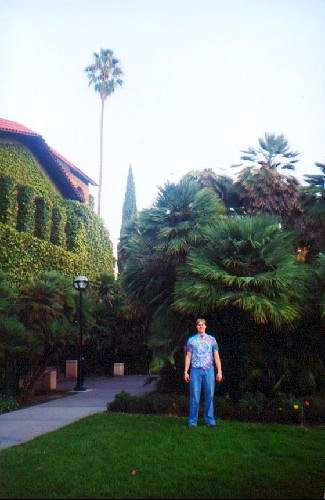

I was just cooking myself lunch, and an old memory came back to me. It was probably around 2001, and I was working in Ottawa. A company in Silicon Valley called me up and asked if I wanted to come down and interview for a fiber optics job. I was only mildly interested in the job, but I hadn’t been to California in a long time, and I thought I’d hear what they had to say. I didn’t really feel like traveling alone, so I asked if they’d be interested in pitching my friend Rob also, which they agreed to.

So anyways, one Thursday afternoon I was sitting in Rob’s apartment in Ottawa, drinking a bunch of beer prior to our flight to San Jose. We got there late at night, and eventually found our way to the Fairmont San Jose hotel. We had early morning interviews, which lasted probably four hours or so. You could tell they were super desperate to have people join their team, as they had far more work than they had employees to do the work.

After the interviews, the CEO called Rob and I into his office and asked us what our plans were for the weekend. We said we weren’t really sure, but were hoping to have a good time and do some sight seeing. In response to that, the CEO took out two pieces of paper and signed the bottom of both, then slid them across the table. They were in fact full-page expense reports for the company, with the CEO’s signature down at the bottom, indicating they were already pre-approved. Basically we had carte blanche for the weekend to spend whatever.

Man, those were the days.