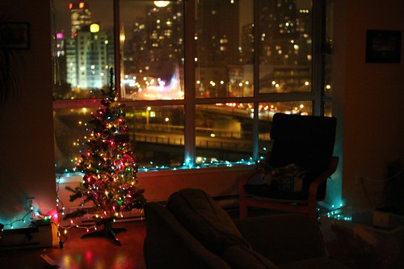

Yes, I realize Christmas is still a long time away. But truthfully, it’ll be here in no time. This will be my first Christmas a resident of Chilliwack since I was 18, and I think it’ll be pretty cool.

The tree in my photo is my little Christmas tree from Vancouver. I’ve had him up a few years now, and he always makes me happy. Truthfully, I kept him up until almost July last year, simply because I didn’t have the heart to take it down. I mean, I’d come home from work, and there’d he’d be, all lit up and happy. How could I take him down?

I know, I’m strange. I get it. This year I’ll take him down in January, I promise. But it’ll be cool to have a tree up next to the fireplace in my apartment. I’m even looking forward to putting a few presents underneath the tree for my niece and nephew. Maybe they can even come for a sleep over at my place a few days before Christmas an open them.

Anyways, still a ways off, but should be fun.