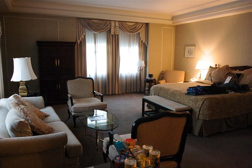

Well, here we are. It’s been a long time coming, but WordCamp Portland is finally here. I spent most of yesterday traveling, mainly due to the slowness of airlines, but ended up arriving around 6:30pm or so last night.

There was a dinner last night for the speakers and sponsors, and it was good to finally meet everyone involved in the event. The restaurant was Ethiopian, which you don’t see too many of back in BC, so it was a great treat. Thanks to the dinner sponsor who picked up the food and drinks last night.

I was originally going to come back to my hotel room last night and work on my slides, but truthfully, was pretty beat. I decided to take the rugby game approach to my slides and take the day off before the game. So while I’ll tweak them a bit over the next seven hours or so, I’m probably just going to present what I already have prepared, which I think will be fine.

I also have to thank the Coast Hotels for giving me their friends and family rate in Portland’s Benson Hotel. The room is basically a small suite with a big, soft king-sized bed, and it’s super comfy.

I have a little surprise in store for my presentation, and I’m hoping there’s audio available up front. If not, I may try to run out and get a little speaker system such that I can play something.

If you’re just passing by here from WordCamp Portland, feel free to drop a comment and say hi! I hope to meet as many people as I can over the course of the next 48 hours, and hopefully see a few people later at a bar. Also check over at [BraveNewCode](http://www.bravenewcode.com/blog/) where I’ll probably put a few blog entries up later.