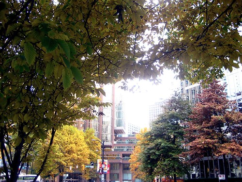

When I got off the plane last night in Bellingham, I was immediately greeted with a big burst of autumn air. Apparently we’re just a few hours away, but last night you could smell it, the faint scent of another season gone by.

Without a doubt, I’m looking forward to it, more so because my plate, which has been overflowing for the last little while, is almost clear. Unlike last summer, where I took a few weeks off, I didn’t really have much time off this summer, other than a day or two on either side of a weekend. The good news is that this fall will probably be intentionally light in terms of projects, so I’m looking forward to getting back into my normal routine.

I used to look forward to all these big technology events and free booze mixers, but lately I just can’t be bothered. I love hanging out with friends and checking out cool things, but I don’t really find the thought of a night spent in a dimly lit bar that appealing anymore. I think I’m going to deliberately spend my weekends doing new and interesting things this fall, maybe making more of an effort to do little road trips here and there. In fact, I’ve always wanted to hike Mount Cheam, so maybe I’ll do that in a few weeks, if the weather continues to hold. I’m also seriously debating getting a pass for Hemlock or Manning this winter so that I can finally take a stab at learning to snowboard.

BarCamp Vancouver is coming up in a few weeks, but truthfully I’m debating not going. The logistics of me attending events in the city are kind of a pain these days, especially after I factor in gas, food, parking and sometimes accommodation. Dropping a $100 on a day trip to the city isn’t that unrealistic, and when I think of where else I could spend that money it kind of puts things into perspective for me. Plus, I hate putting my friends out by asking for their couch, so it’s something I try not to do as much. I’d also really like to have a few consecutive weekends at home where I can get everything in order and maybe go buy a few things I’m sorely lacking, like a shoe rack.

Other than that, my only real goal this autumn is to ramp my guitar playing up quite a bit, and keep going to the gym as much as possible. I’m hoping to be a home body for most of the next two months. In November I’ll be in Seattle for a weekend, and then on to Punta Cana for two consecutive weeks.