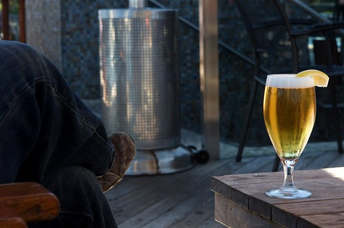

Two of my friends, Dale and Patrick, are currently out from Ontario visiting. For the most part, it’s been a university type weekend, filled with late movie nights and copious amounts of beer. We’ve also been eating for six people, even though we’re only three, thanks mainly in part to Patt’s love of cooking.

On Saturday we woke up in the morning and decided it was such a nice day that we’d head down to Stanley park for a few hours. We ended up on the patio at Lift, drinking a few beers around their outdoor fire pit. Jump ahead a few hours later and we found ourselves visiting a friend in the suite of a local downtown hotel.

We really didn’t plan anything in Vancouver, since we were only planning on hanging out for a few hours, but decided afterwards to head over to our friend Chad’s house in Burnaby. Someone made the suggestion around 10pm to play a bit of poker, and so that’s what happened. That naturally lead to some late night pizza and wings, and the demolishment of a full fridge of beer. I passed out on a couch around 3am (after losing my chips), but apparently the poker game went on between Chad and Patt until around 6am. I had one of those great “slept with my head at a 90 degree angle” kind of sleeps, so was a bit grumpy when I woke up. Needless to say, yesterday was a pretty slow day around the house here. My neck is actually still pretty sore from that night on the couch.

I woke up this morning and the temperature inside my apartment was 67F, which is the first time in months that it’s dropped below 70F. I guess that means fall is officially here, and soon the heater/fireplace will be making a reappearance.

I’m taking Dale and Patt back to the Abbotsford airport this afternoon for their trip home. After that, it’ll be back to normal around here, with another week of hard work. The good news is that our schedule is deliberately opening up in the near future, which Dale and I plan to use to casually take care of a few items we’ve been meaning to tackle for a while now.