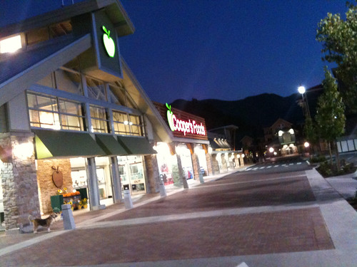

A few weeks ago my friends Patrick and Dale were in town. Patrick is actually a pretty good cook, something that was evidenced by a lot of the meals Patrick made for us while he was here. One of the things that visit did was remind me how much I enjoy tinkering around the kitchen, and just how much better fresh/good food tastes.

One of the things that’s cool about Chilliwack is just how easy it is to get fresh ingredients. Next door to me is a big Cooper’s grocery store, which I can most things at in a pinch. While it has a good selection, it’s a lot more money than some of the specialty shops in town. In terms of meat, I usually head down to [Fraser Valley Meats](http://www.fraservalleymeats.com). In any given week they usually have a bunch of sales going on, so I typically stock up every once and a while and simply freeze what I’m not using. Not only can you get really good cuts of meat at great prices, but they’ll also give you ideas about whatever you’re cooking. If you buy a steak or a roast, they’ll also offer to put it in one of several rubs for you, all for free. Got knives that need sharpening? No worries, take them down to Fraser Valley Meats and they’ll sharpen them for you as well.

In terms of vegetables, I’ve been alternating between two places recently. One is a little market in the Cottonwood Mall that deals with mostly local produce. Yesterday I was down there and picked up a few bags of local vegetables. I still find it surprising that I can get that much food for only $12 – $15. The other local vegetable market I go to is in the new Sardis Park village (I can’t remember the name of the store). The main reason I like it is because it’s also next door to a specialty seafood store called “The Docks”. That means I can get a pile of produce and also grab some fresh seafood for whatever meal I want to cook on the weekend. In addition, the Docks has a few gourmet shelves where you can pick up some hard-to-find sea salts, rices and flavoured oils. It’s actually kind of fun browsing it every few weeks.

There’s also another Gourmet Meat store near me called Johnson Gourmet Meats. I used to go there quite a bit, but I find it rather expensive. Because it’s also a bit isolated, it involves a separate trip whenever I go there, so I haven’t been by in a while. They do have a nice salad/deli section though in case you want to grab some meatballs or colesaw to take home with you.

Yesterday I was in the car, bouncing between markets and buying groceries, and it reminded me of just how much of a pain doing the same thing was in Vancouver. In fact, my only real options for groceries in Vancouver involved walking down to Choices or Urban Fare, both of which were really expensive, and then walking home with a pile of bags. I sometimes got in the car and went to Safeway, but with normal downtown traffic that was often a pain. In the same amount of time that it took me to visit one grocery store in Vancouver I can typically hit three or four in Chilliwack, often getting far better quality produce in the process.

I bought a food processor on the weekend, which now means I can start making some of my own vegetable soups and sauces. I also managed to get my hands on a 1,000 page culinary book on the weekend, which should make for some interesting reading over the next little while.

Anyways, I’m just finding it pretty cool being close to fresh ingredients, and am enjoying the fact that I can make a trip to any one of those stores and be back home in about 20 minutes. One of the added benefits of living outside of the city I guess.