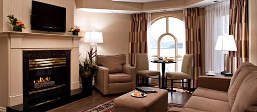

A few hours ago I spread my legs out on the couch hoping that my headache would go away if I rested for a few minutes. I just woke up, and realized that I had actually fallen asleep for around two hours, which I guess means I was pretty beat.

As I mentioned before, I’m heading out of town for the weekend. I’ve been treated to a complementary weekend in Kelowna thanks to the [Grand Delta Okanagan](http://www.deltahotels.com/hotels/hotels.php?hotelId=221) hotel. It’s a great hotel situated right on the lake, and the Delta is putting me up in one of their nicer suites for the weekend.

Tomorrow night I’m being treated to a really nice dinner in their new restaurant. Other than Earl’s here in Chilliwack, it’s been a while since I’ve had a nice dinner, so I’m looking forward to that. On Saturday, tourism Kelowna is also treating me to a few cool activities:

- St. Hubertus Harvest Lunch – The Harvest Lunch is to celebrate the start of the new harvest and showcase Okanagan food. Each lunch is designed by a local chef and matched with St. Hubertus and Oak Bay wines. The meal will be served at a beautifully set long table under a white marquee in the vineyard.
- Cedar Creek Estate Winery Tour and Tasting
- House of Rose Fall Grape Stomps – A good old fashioned grape squishing event! Should be some great photo opportunities here

I’ll probably also squeeze in a few more activities of my own, and will probably set out on a photowalk during the morning.

I’ll be leaving Chilliwack around 1pm or 2pm tomorrow, which should put me in Kelowna with enough time to relax at the bar for an hour or so before I have to show up for dinner. Should be a great trip, and I’m looking forward to it! Big thanks to Delta resorts and tourism Kelowna.