A while ago I was approached by a Vancouver public relations company and asked if I wanted to be a guest of the [Delta Grand Okanagan](http://www.deltahotels.com/hotels/hotels.php?hotelId=221) hotel in Kelowna for a weekend. The offer came right at a period of time where I was feeling a bit burnt out, so I gladly accepted and started packing my bags.

The route from Chilliwack to Kelowna involves taking a highway through the mountains. Depending on the weather conditions, often you’ll find snowy conditions near the summit. Just in case I encountered those types of conditions I packed my chains for the car and also left early in the afternoon so I’d pass the summit while it was still bright outside. I rolled into Kelowna at around 5pm, and immediately headed to the hotel.

The Delta Grand Okanagan hotel is located right on lake Okanagan and offers an amazing view of the surrounding hillsides.

[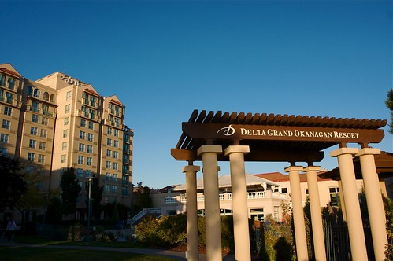](http://www.flickr.com/photos/duanestorey/3997353250/in/set-72157622427244817/)

The Delta was nice enough to put me up in one of their private suites, which are one, two and three bedroom apartments located on an adjacent property. They offer private parking (which requires the use of a specialized FOB) and also a full featured amenities area.

[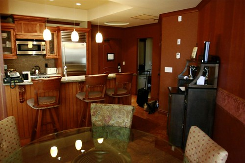](http://www.flickr.com/photos/duanestorey/3996150227/in/set-72157622427244817/)

The suite was really quite lovely, featuring a gas stove, stainless steel appliances, a washer/dryer, a bathroom, dining room with an adjoining patio, living room with a gas fireplace, and a bathroom complete with a full ensuite.

[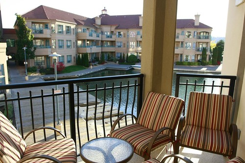](http://www.flickr.com/photos/duanestorey/3996152045/in/set-72157622427244817/)

The suites are arranged such that many of them overlook the water, and I imagine it’s a great place to read a newspaper or to sit and drink an early morning coffee. The suites contain a full kitchen, complete with dishes, so it’s conceivable you could come and cook most of your meals within your own hotel room. If that’s not your fancy, room service is also available for 24 hours a day.

Shortly after checking in, I decided to head up to the roof top where the amenities area is. At the top is a gym that contains a few elliptical machines and treadmills, both of which look out over the water. The main attraction though is a gorgeous pool and hot tub combination, the former of which starts inside and gradually extends to the outside of the rooftop.

[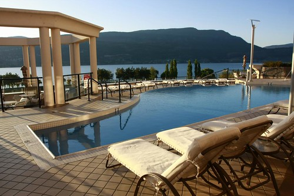](http://www.flickr.com/photos/duanestorey/3996588603/in/set-72157622427244817/)

[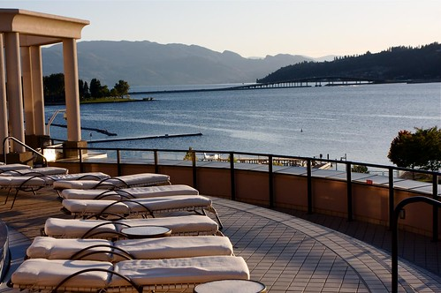](http://www.flickr.com/photos/duanestorey/3997352402/in/set-72157622427244817/)

Downstairs near the lobby is the main restaurant at the Delta Grand Okanagan: the Grand Bay Café. The Grand Bay Café provides its visitors with not only a cozy, welcoming atmosphere, but also a really amazing view of the water and the surrounding hillside. I was treated to a free, full course meal, which allowed me to taste a bit of everything.

First up was wine. Obviously being in the Okanagan, the wine list was well stocked with local varieties. Given how I was leaning towards having a steak, I opted for a $60 bottle of Cedar Creek’s 2006 Platinum Pinot Noir.

[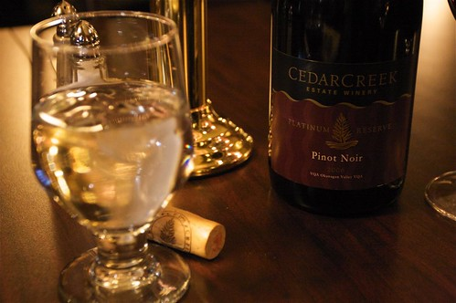](http://www.flickr.com/photos/duanestorey/4006498541/in/photostream/)

While enjoying my wine, the chef personally came out and gave me a specially prepared plate of Ahi tuni. It was a nice touch, and it gave me something to nibble on while I scanned the menu.

[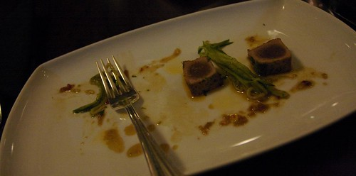](http://www.flickr.com/photos/duanestorey/4006498541/in/photostream/)

In terms of an appetizer, I decided to have something hearty and warm, mainly because it was about 3 degrees Celsius outside and I had been a tad cold after my photo walk. Thankfully, the Grand Bay Café had the perfect appetizer for me, a smoked salmon chowder.

[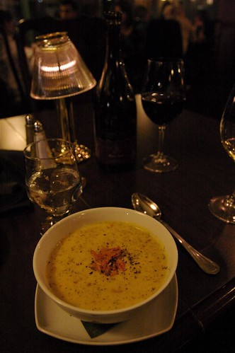](http://www.flickr.com/photos/duanestorey/4007265164/in/photostream/)

The chowder was actually really amazing, and it definitely hit the spot after being outside for an hour.

In terms of the main course, I decided to have a rib-eye steak. I actually haven’t had any steak in well over a month, so I thought it would be a nice change. The rib-eye came with roasted asparagus and red peppers, as well as a tasty potato side dish.

[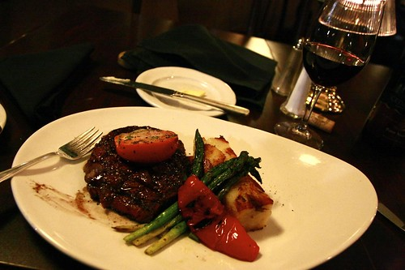](http://www.flickr.com/photos/duanestorey/4007265340/in/photostream/)

The steak was a very nice cut of meat, and practically melted in my mouth. The wine pairing was quite nice as well, and I’m glad I ultimately picked that pinot.

While the meal was progressing, I managed to have a few interesting conversations with my waitress and the resident wine expert. Given how my knowledge of ice wines is fairly lacking, I was treated to a flight of some of the best ice wines in the house.

[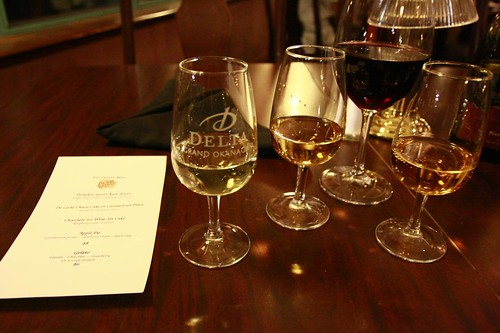](http://www.flickr.com/photos/duanestorey/4007265676/in/photostream/)

At that point, I ordered desert. I actually asked Twitter which desert they recommended, based on a screenshot of the menu. Most people came back and recommended I try the chocolate raspberry dish, which I thought would be a great way to end the meal.

[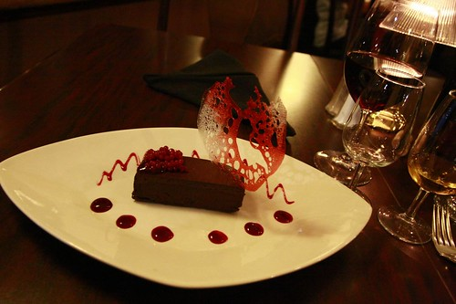](http://www.flickr.com/photos/duanestorey/4007309564/)

It tasted as great as it looked.

Given how I still had a half a bottle of wine left to finish, the waitress offered to bring that up to my room for me, which I gladly accepted. I thanked everyone and then headed back upstairs to relax for a while. By the time I had the place warmed up with the gas fireplace, someone had arrived at my door with what was left of my wine. So, I curled up in front of the TV with a glass of pinot and a roaring gas fireplace for the evening.

[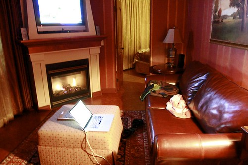](http://www.flickr.com/photos/duanestorey/3996665203/in/set-72157622427244817/)

I had an amazing weekend in Kelowna, and can’t say enough good things about how I was treated at the Delta Grand Okanagan. So, a very big thanks to the Delta for putting me up for the weekend and taking care of me. I also want to thank Rachel Thexton who helped organize the trip for me, as well as Tourism Kelowna for setting up a few wine-related activities for me during the weekend.

[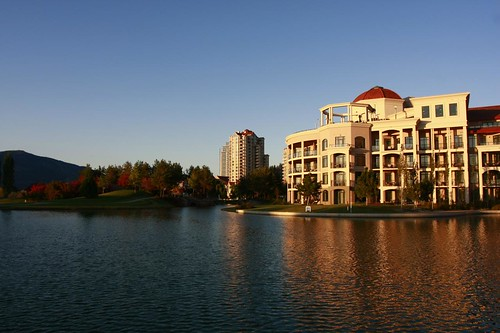](http://www.flickr.com/photos/duanestorey/3997354542/in/set-72157622427244817/)

If you’re looking for a really picturesque location to visit in the heart of BC’s wine country, then look no further than the Delta Grand Okanagan in Kelowna. If you can swing it, definitely opt for the private villas, as they are extremely cozy and offer all the amenities of being at home as well as an amazing roof-top pool and hot tub.

If you’d like to see more photos from the trip, you can [head on over](http://www.flickr.com/photos/duanestorey/sets/72157622427244817/) to my Flickr stream.