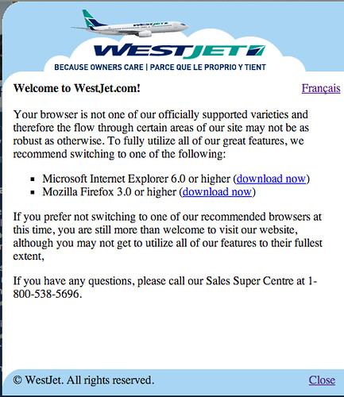

So, I love WestJet as an airline. They are fun, funky, relatively cheap, and they fly out of Abbotsford, which is a way better location for me than Vancouver International Airport. That being said, their website doesn’t support Safari on the Mac (possibly just Safari 4), which I think in this day and age provides a pretty poor user experience. Here’s the notification you get when you fire up your browser:

First, I’m glad WestJet supports an ancient browser like IE, but given what a forward thinking company WestJet is, I’d really like to see support for some more modern browsers such as Safari. If they don’t support Safari, that also probably means they don’t support Mobile Safari, which seems to be a pretty poor decision for a demographic that’s always on the move. Also, please, for the love of god, don’t recommend that people upgrade to IE 6. We’re trying our best as a community to phase that browser out of existence.