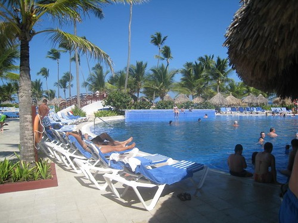

I woke up late today, not that I’m really keeping track of the time or anything. I was originally gonna stroll down to the gym when I woke up, but slept a bit later than I normally do so I skipped the gym and the morning buffet. I met Dale and Sara by the pool for a few hours of reading, a bit of snack bar love, and then ultimately made it down to the gym for a bit of a mini workout.

The days here seem to go fairly quick, even though we don’t really do all that much. Most of the time we all just sort of relax by the pool or the ocean, and the days are split up with a meal here and there or a trip to the pool bar. Rebecca and John get here on Thursday, and Sara is heading back to Toronto on Friday. After that, Dale and I will be transitioning into working-vacation mode, and will be attempting to plan out the next year or so of activities for ourselves. We have a lot we really want to do, but given that we work virtually most of the time, really appreciate these times when we can brainstorm and bounce ideas off each other in real time. The fact that we’re a two person company that’s only a little over a year old, and we’ve managed to help some amazing clients and also end up with two of the top three WordPress plugins (as voted by users this summer in San Francisco) is something we’re totally appreciative of, and something we’d like to build off of in the near future. We have a lot of ideas, and we’re going to spend next week figuring out all the steps we need to do in order to execute on some of them.

The next two days will most likely be more of the same. I think Dale and Sara are going parasailing tomorrow, and I might try a bit of windsurfing. Other than that though, it’ll be a bit of suntanning, the casual drink, and I’ll probably start my third book (having finished two so far).