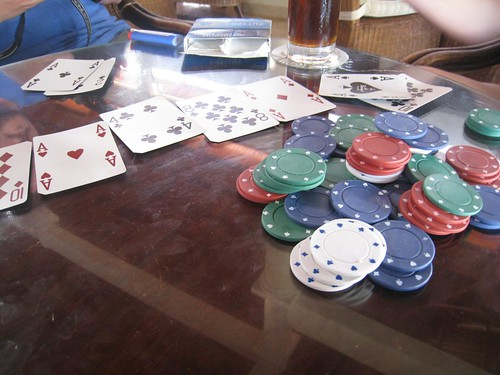

Quick update. Right now Rebecca and John are in the air, or about to land. This is officially day 8 here for me, which means there are fewer days ahead than there are behind. We’re all having a great time here, and have spent most of our days reading and swimming by the pool.

The other night I ventured off the resort and ended up at the Hard Rock cafe in Punta Cana. I met up with a few Vancouverites and we all went to a dance club until about 5am or so in the morning. I stumbled back into my room around 6am, and passed out for the better part of the day. That was the first night I hit the sauce, and I definitely paid for it the next day. Other than that, I’ve hardly really touched any alcohol down here, other than one or two by the pool from time to time.

For those who know me, I typically always get a bit antsy when I’m away from home. This time I’ve actually been pretty content, probably because I brought enough books to read and have been taking it pretty easy. I imagine at the end of next week I’ll be ready to head home though and eat some home cooked meals again. But for now, we’re all having a good time.