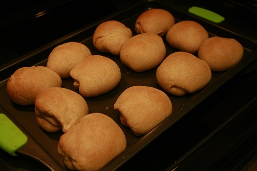

Ah yes, here we are. Given that we’re only four days away from Christmas, I’m starting to think that maybe I should do some of my Christmas shopping. I’m a pretty big shopping procrastinator though, so I imagine it’ll be down to the wire. Strangely enough, I haven’t really gotten into the Christmas mood yet, which is rather unusual given how much I enjoy Christmas.

Last Christmas I ended up working through most of the holidays, so this year I’ve decided to take it easy and enjoy a bit of downtime. While I have a few things that I’m going to be working on passively, I’m just going to be laying low and enjoying some time with everyone.

I’ve been on the fence about hiring a cleaning person for my apartment for quite some time, but finally decided to bite the bullet and get one. I had a cleaner in Vancouver, and it was really nice actually. There’s nothing better than leaving a messy apartment in the morning and coming home to look and smell of a clean apartment in the evening. For me at least, I’m not really that good at cleaning – to clean this apartment would probably take me a full Sunday, and a big effort every week to keep up with the dusting. So for me it’s well worth the money to not have to worry about it anymore. In addition, my sinuses actually feel a lot better now that my condo is really clean again, and that’s actually equated to a couple of more restful sleeps. So I think it was a good decision.

On boxing day my family is having a big Christmas dinner together. Because I’m the single bachelor in the family, everyone jokingly decided that I was to simply go to the store and buy buns for dinner (while everyone else is tasked with cooking various portions of the meal). So, I figure the least I can do is to cook those buns myself. Since I don’t really like leaving too many things to chance, I decided to do a dry run tonight to see what’s involved and how they would taste. I have to say, the turned out quite awesome (although I probably could have shaped them a bit better).

Other than that, not too much new around my world here. I was in the city briefly on Friday to visit a few friends quickly, and spent the remainder of the weekend enjoying how clean my place is again. Tomorrow I’m going to get back to the gym and probably reorganize some of my cupboards around home (I’m so exciting, I know), and probably write a big blog entry on my thoughts regarding the movie **Food Inc.**, which I watched last night and really enjoyed.