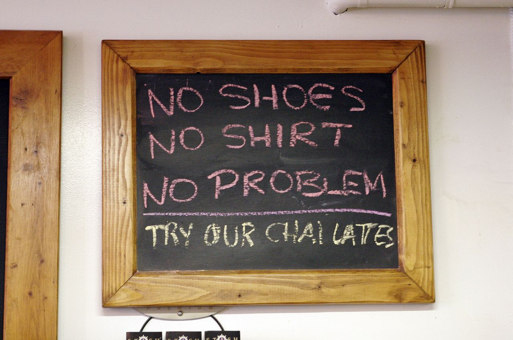

I have to say, I’ve always been in that camp where cheaper was generally better, at least when it came to retail items. Part of that was because usually my knowledge of what I was buying was greater than that of the 17 year old kid trying to sell the product for me. So in that case, might as well get the item as cheap as possible.

Chilliwack has definitely undergone a fairly big transition in the last ten years, moving from small, family run businesses to mostly large franchise stores. A few years ago one of the only places to buy electronics in town was a store called John’s Electronics, which was eventually forced to shut down when Future Shop came into town. I was always surprised when I’d come back to town here from Vancouver and see just how many shops had changed ownership in our local mall. I guess it’s hard to stay relevant when you are fighting against the big chains, many of which can get lower cost items simply by buying them in such high volumes.

That said, as I get older I’m starting to appreciate more and more the one-on-one interaction you get by going to a smaller store. Sure, you’ll probably pay a bit more, but the trade-off is that you actually get to form a relationship with the employees or owners, and are usually looked after a bit more. I was down at a store that some of my friends work at here in town the other day, 604 Autosound, and was watching just how they do business. An older fellow came in and asked for a pair of $4 speakers that were advertised in the paper. The sale was actually for boxing day, so it hadn’t started yet, but to save the elderly fellow from having to make another trip to the store in a few days, they simply gave him the speakers for $4 and wished him a Merry Christmas. I can’t say for sure, but I doubt Future Shop or Best Buy would have gone to the trouble to help that guy out.

So, I’m glad at least that there are still a few small, family run businesses here in town that I can go to from time to time. Every once and a while you still need to hit a place like Future Shop to get items that some of the smaller stores don’t carry, but you really can’t place a price on the one-on-one interaction you get at a smaller store, or the degree to which they usually attempt to help you out when you have problems later on down the road.

Anyways, I’m not big on shopping, so I’m staying out of the boxing day madness. I have a family dinner to hit at around 1:30pm, so I’m gonna start cooking the perogies in an hour or so.