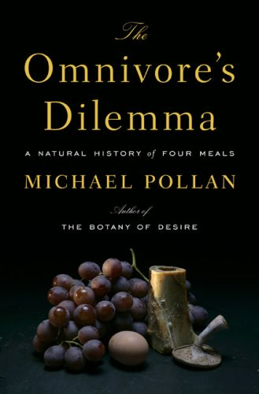

Recently I sat down and watched the movie *Food Inc.* which is a very informative documentary about where our food actually comes from. One of the chief consultants for that movie was a guy named Michael Pollan, who has written numerous books including The Omnivore’s Dilemma and In Defence of Food.

After watching the movie, I decided to sit down and read The Omnivore’s Dilemma, which I actually ordered about a year ago but never found time to read. There’s a lot of overlap in the book with the content of the movie, so I had most of the key points already in mind. After reading the book, there are actually a few scenes in the movie that make a bit more sense.

Michael’s key thesis is that what we buy nowadays as food really isn’t food in the traditional sense: sure, it looks like food and sort of tastes like food, but it’s been so overly processed that it really is a shadow of what food should actually be like. For example, tomatoes, which normally are vine ripened and eaten relatively fresh, are now picked green and ripened using gasses on trucks as they make their way to the supermarkets. Beef, which used to be primarily grass fed (which coincidentally causes almost all the fat in the beef to be good fats), is now mostly grain fed, partially for cost reasons and partially to help fatten the cows up as quickly as possible. Cows never evolved to eat grains, and so most cows are routinely fed antibiotics to help keep them “healthy” while they fatten up.

What’s interesting in the book is how clear it becomes just how far we’ve come from natural methods of growing food and raising animals. Animal waste was once the primary fertilizers for most fields; nowadays, the animal waste is transported off the farm, and petroleum-based fertilizers are used instead. So while nature provided an easy, healthy way to dispose of animal waste, the modern food industry has instead replaced that with two elaborate processes involving fossil fuels.

The book is very informative, and for the most part, a fairly easy read. If you care about what goes into your body, then I recommend reading this book and also watching Food Inc.