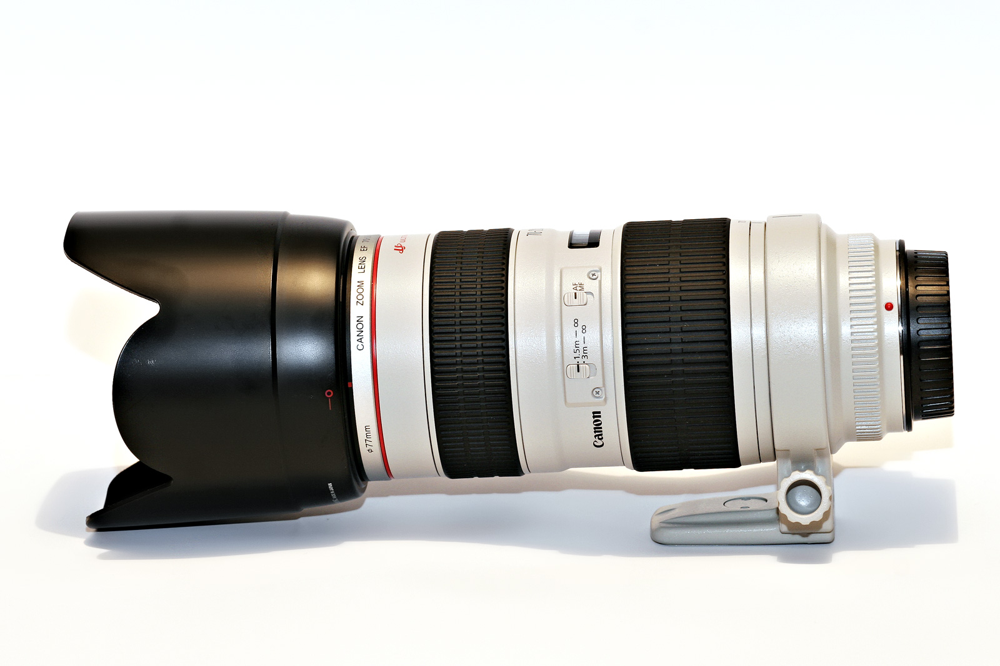

Canon has just announced a brand new EF 70-200mm f/2.8L IS lens – the 70-200mm f/2.8L IS II. This is one of Canon’s most popular L-series lenses, and is pretty much a must-have for most serious wedding and event photographers. I have the non-IS (image stabilized) version, which works fairly well in most scenarios, but I’ve heard the IS version allows you to hand-hold shots in scenarios where the non-IS version would fail.

Here’s [some information](http://www.digitalcamerareview.com/default.asp?newsID=4195) on it:

> Canon has improved the optical performance by redesigning the internal elements, incorporating a fluorite element and a fifth UD element to help minimize secondary chromatic aberrations and produce better image quality with improved contrast and resolution through the entire zoom range. The new lens design features improved auto focus speed due to a new focusing algorithm and a shorter minimum focusing distance of 3.9 feet (1.2 meters). It also features improved image stabilization allowing it to compensate for shutter speeds up to four steps slower than 1/focal length, a one step improvement over the previous lens model.
> 
> The new lens retains Canon’s protective seals and fittings providing dust and water resistance. A new bayonet mount on the front of the lens includes a locking mechanism to ensure the supplied lens hood remains securely in place. Other improvements include a wider focusing ring and sleeker design achieved by reducing the thickness of any protruding elements such as the switch panel. The new lens is compatible with Canon’s existing EF1.4X II and EF2X II Extenders as well as EF Extension Tubes and the 77mm Close-Up Lens 500D.

Truthfully, I’m not overly excited. The 70-200mm f/2.8L is easily the sharpest zoom lens is my kit. In fact, it’s so sharp that it’s scary. So I don’t really see the need to add another optical element to make it even sharper. Image stabilization is a neat trick that helps in many scenarios, but even if you prevent camera shake with IS, you still can’t prevent your subjects from moving while you’re holding a lens. So while yes, it allows you to hand-hold shots at shutter speeds that would normally result in blur, your subjects can still move a bit during that time and cause the shot to be ruined.

I’ll reserve full judgement until I try one out, but given the popularity of the lens, these seems a bit like a cash grab to me.