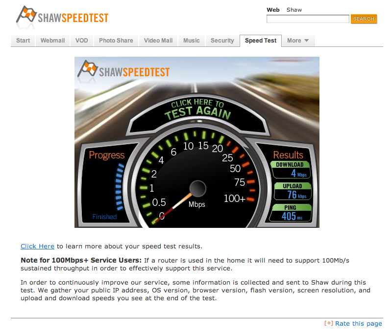

Seriously. It’s a massive slap in the face to be on hold for over an hour with a company while they’re playing on-hold advertisements talking about how much better their customer service is than everyone else’s.

My internet has been slowing down consistently month after month to the point where it’s become nearly unusable. I’m paying for one of their higher end packages which is supposed to give up to 15 Mbps downstream and up to 1 Mbps downstream. Here’s what it’s been like for the last few weeks:

Right now I’m getting 4 Mbps downstream, and only **76 kbps** upstream, with ping times of around 400ms – absurd. The plan below me offers 10 Mbps, so at the very least I should be guaranteed that, otherwise what am I paying for? The upstream is completely pathetic, and doesn’t even allow me to start up video on iChat anymore. I’ve been trying to upload a few videos from North Carolina to Facebook, but the upload duration is so long Facebook eventually shuts it down.

I called a few weeks ago and waited for about an hour on hold to finally talk to someone. They sent a technician down a few days later, and the technician agreed my speeds were pathetic and that it didn’t seem to be a problem in my unit. He said that they’d send a technician to check the building, and that the problem would magically fix itself in a week or so. Surprise, surprise, it’s still the same.

Last night I called technical support, and got disconnected while talking to a technician. I tried calling back, and gave up after an hour as I wanted to go to sleep. Tonight I’ve spent the last 70 minutes on the phone with Shaw. After 30 minutes, some girl answered, took a few notes, and then tossed me back into the queue for another 30 minutes. When I emerged on the other side, I was talking to someone in Nanaimo who didn’t have access to do anything with a Chilliwack account. So here I am again, back in the queue, waiting to talk to someone again. I’m a fairly patient person, but it honestly shouldn’t take over an hour to talk to someone at technical support, especially when I have one of the higher end packages.

If they can’t fix it in the next day or two I’m going to be forced to ditch it entirely and go with Telus. As it is, I simply can’t work from home, and am forced to work from coffee shops all day, which sucks.