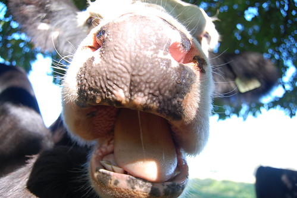

I said the other day that I wasn’t going to make any New Year’s resolutions, and for the most part that’s true. One thing I’d like to do this year though is to try and eat as healthy as possible. For starters, I gave up soft drinks the other day completely. I’m sure I’ll still have a rum and diet coke from time to time, since it’s been my drink of choice for around 12 years now, but I’m going to try not to drink any type of carbonated beverages around home for the most part if I can. I haven’t had any diet coke in about five days now, which is a pretty big accomplishment.

Second, and I imagine this will fluctuate as well, I’ve reduced my caffeine intake to basically nothing right now. While I do enjoy a nice cup of coffee from time to time, I’ve had a lot of trouble sleeping these past few years, and caffeine only makes it worse. I’ll probably still have a cup in the morning every once and a while, but so far I’m pretty much caffeine free since New Year’s day, and already I feel a bit more alert.

The last item I’m going to try and do is to shop locally whenever possible. Out in the city it’s not that often that the food you eat was made or grown locally, but out here in the country it’s a different story. Many of the local stores I go to have local items, many of which are even organic. Unfortunately at this time of year there aren’t a lot of local vegetables available, so while I try to get local produce when possible, I’m forced to get a lot of US grown vegetables as well.

In terms of meat, I’ve been buying Farm Fed chickens when I can, which are raised in Abbotsford mostly on a traditional diet, and allowed access to the outside. As soon as I get a chance, I’m going to pick up some hormone-free, grass-fed beef from a local farm as well, either [Sumas Mountain Farms](http://www.sumasmountainfarms.ca/products.php) or [Mount Lehman Farms](http://www.grassonlybeef.ca/html/about_our_beef.html). Compared to most industrial grain-fed cattle (many of which spend their lives eating grain while standing in their own manure), grass-fed cows typically lead relatively stress-free lives out in the pastures, helping fertilize future crops with their manure. In addition, grass-fed beef is far healthier to eat, mainly because it is low in saturated fat and high in omega-3 fat (which comes from grass). And truth be told, I’m rather excited about trying to make nachos using grass-fed beef.

Truthfully, I appreciate living in the country a lot more now than when I was a kid. It’s neat seeing how the community works and interacts together, and how the small businesses go out of their way to talk to you and learn about you. Unlike at a large grocery store, most small businesses have accountability with regards to the food they stock and also sell. The other day I was down at the Seafood Store and the owner asked me what type of fish I’d like in next week, and they’d special order it for me. It’s nice to have that kind of relationship with a store owner, especially when they are selling a product that has a direct influence on your health.

Cow photo was raised on Flickr-grass by the venerable [John Biehler](http://www.johnbiehler.com)