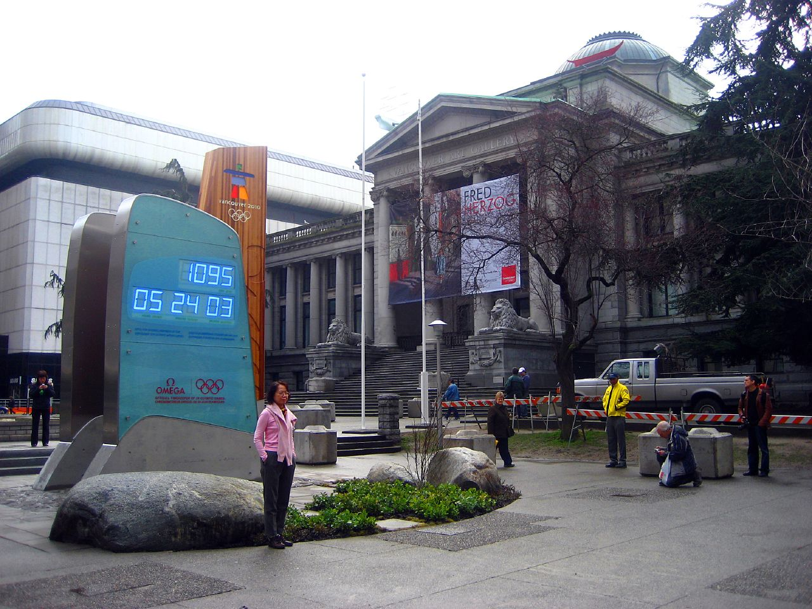

Hard to believe the Olympics are only a few short weeks away. When I was living downtown I remember when they erected that big countdown clock. I remember thinking it seemed strange that they put that up nearly three years before the event, but I have to say, it went fairly quick.

It’s interesting to see the city ramp up to the event, and all the associated problems that are starting to occur. Last week the local skihill Cypress [shut down in an effort to save snow](http://www.onthesnow.com/news/8/a/11027/cypress-mountain-shuts-down-to-save-snow-for-olympics) for the actual Olympic runs. Given the unseasonably warm temperatures right now, it’s even hard for the local mountains to create their own snow, since this requires a temperature as low as at least 0C to work. So last week Cypress began the process of driving snow up to the top of the mountain in an effort to preserve it.

John Biehler reported that the seabus on the North Shore was essentially overflowing this morning, due to a tree falling down and blocking the [Lion’s Gate Bridge](http://twitpic.com/ynwy1) \[HT John Bollwitt\]. In addition, the roof at BC Place [partially inverted](http://vancouver.24hrs.ca/News/local/2010/01/18/12512016.html) recently, reportedly due to all the extra cabling and lights that are in place for the opening ceremonies.

In terms of parliament, we all know that’s broken. It seems like Prime Minister Harper decided he needed more time to talk to the people and, most likely, to hang out at the Olympic games. So as a result, he [has suspended parliament](http://www.theinternationalonline.com/articles/115-canadian-parliament-suspended-at-request) until March of 2010.

I’ve been watching the Twitter chatter, and it seems like there are just as many people leaving the city during the Olympics as there are staying. As for me, I’ll be at home out in the valley, and suspect I’ll be far away from the downtown core during the Olympics. If you’re planning on being in town, drop a comment and let everyone know what you’re going to be up to (watching events, taking photos, people watching)?