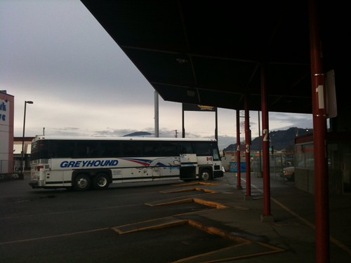

I’m somewhere near Surrey I think, stuck near the back on a Greyhound bus. The mood here is pretty dismal — most people are either sleeping or in some weird state of iPod euphoria. The scheduled arrival time, barring any major road hiccups, is around 12:10pm I think. The first order of business for me will be to store my luggage somewhere, most likely in a locker in the bus terminal. That’ll of course mean that I have to come back and get it later, but that’s way better than walking around with a suitcase all day.

It’s no secret that I haven’t been a huge supporter of the Olympics games in Vancouver. Contrary to what people may think, I’ve never been opposed to the spirit of the games, or to any event that can bring people together. My only real opposition was in terms of the price tag for the event. It’s unfortunately hard to ignore that the Olympic games have cost the province a fairly enormous amount of money that will most likely translate into reduced medical services in this province over the next few years, as well as in education. The hope is, of course, that the games will recuperate those costs through tourism and improved access to places such as Whistler. Only time will tell.

That said, the games start today, and it’s time to show the world what the city of Vancouver is all about. As for me, you won’t hear anything more negative about the games — we all paid for them, so we might as well all enjoy them. I’m hoping to walk around with my camera showcasing some of the people of Vancouver, hopefully doing a few video segments with my Powershot camera from time to time. I’ll hopefully spend my evenings with friends and strangers, drinking beers in a few loud bars, watching TVs and meeting new people.