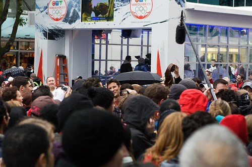

Shortly after arriving in Vancouver, I saw someone Tweet that the Barenaked Ladies were busking on Robson Street, so I strolled on down. Sure enough, right on the corner of Robson and Burrard was a massive group of people and music playing. I only got to listen to a few minutes worth of music, but the crowd was definitely into it.

Here’s a shot of the bass player, Jim Creeggan, that I snapped shortly after the show was over:

