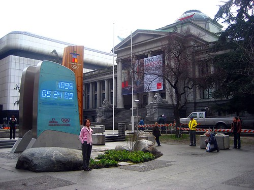

I have all my camera gear packed up, which for me, is quite a lot of stuff. I pulled my old laptop/camera-bag out of retirement, which means I can have the majority of my gear, as well as my laptop, all in the same bag. It is as convenient as it is heavy.

I bought a ticket on the 10am Greyhound bus leaving Chilliwack for downtown Vancouver. I decided that having my car in the city wasn’t really a good idea with the games going on. Right now I’m just sipping a coffee, then I’m going to head down to the Greyhound and wait down there. I have a pile of work on my laptop, so I should be able to get some done while in transit.

Tonight is of course the opening ceremonies for the Olympics. It’s hard to believe that nearly three years ago I had taken this photo, which shows the countdown clock at over 1000 days until the Olympics.

I’ll find a little coffee shop and hole myself up for the afternoon, and most likely make my way down to Yaletown to watch the opening ceremonies with Yahoo! on their screen. After that, who knows. The next week or so is undoubtedly going to be a bit nuts.

If you’re stuck at home and are looking for a bit of an escape, make sure you check out [the live Yaletown Web Camera](http://www.migratorynerd.com/blog/2010-winter-olympics/live-yaletown-web-camera-during-the-games/), which should hopefully provide a few shots of the torch run.