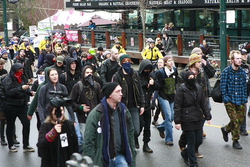

This morning I got to walk along Robson Street and watch the protests as they occurred. Given that I saw first-hand how the police officers and the protesters interacted, I thought I would make a few comments.

First, it is everyone’s democratic right in Canada to be allowed to protest peacefully — these rights are protected by the Canadian Charter of Rights and Freedoms. That said, you are not allowed to protest violently, or to break any of the normal laws of this country while in the process of protesting. Vandalism and destruction of property are not forms of protest, they are forms of violence.

For the most part, I didn’t witness any altercations between the police and the protesters. I was actually surprised when a few protesters knocked over some newspaper bins that the police didn’t intervene. I suspected that the police were waiting for more people, or perhaps to box the protesters in before making any moves. Later on TV it looked like that was the approach they took, and eventually helped disperse the crowd.

While I support peaceful protests, given the anger of the protesters this morning and the infectious nature of the crowd (it seemed to be getting larger as they walked), I’m in full support of the police eventually dispersing it. I have no real experience with crowds of this nature, but I remember what happened after Vancouver lost the Stanley Cup — it only takes a few bad eggs to start a situation which can eventually spiral out of control in short order.

There were many photographers this morning who managed to take some great shots of the protests, including [John Biehler](http://www.johnbiehler.com), [John Bollwitt](http://www.johnbollwitt.com), and [Kris Krug](http://www.kriskrug.com), and I think social media has already shown its weight in the early days of the 2010 Olympic Games. Hopefully the grass-roots coverage continues to expand such that there will continue to exist an unbiased news source during the games.