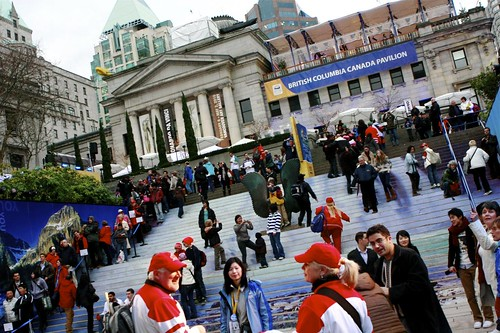

I’ve started putting some of my Olympic photos on VancouverStockPhotos.ca for use by organizations seeking stock photos from around Vancouver during the Olympics. John Biehler is also going to be putting a pile of his photos up soon there, so if you know of anyone looking for commercial licenses for photographs, by all means send them to the [2010 Olympic Stock Photos](http://www.vancouverstockphotos.ca/photos/category/stock-photos/by-type/2010-winter-olympics/) gallery.

If you’re a non-commercial organization, then you are free to use the photos as long as you follow the attribution clauses as indicated on their associated Flickr photos (non-commercial, attribution). The set of CC licensed photos are available on my [2010 Winter Olympic Photo Set](http://www.flickr.com/photos/duanestorey/sets/72157623279292139/).