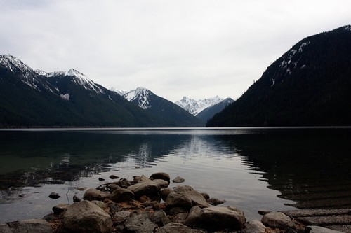

Rebecca and John showed up late Friday night to hang out in the country for the weekend, which was a nice surprise. We had planned to do a quick hike on Saturday, but none of us were really up to the challenge when the time approached. So instead, we decided to drive the 40kms or so from my place to Chilliwack Lake.

I hadn’t been there in probably around 10 years or so, so it was cool being back, especially with the snow-capped mountains surrounding it this time of year. I’m going to have to try a camping trip up there sometime this summer, as some of the spots looking fairly nice.

Other than that, I had some uncle duty to perform during the weekend — it was my nephew’s birthday, so we all went ice skating and then had some cake at his place. All in all, a great weekend. This next week is probably going to be fairly busy, so I’m going to try and call it a night early tonight.