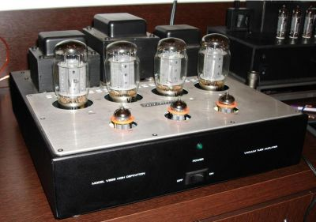

Back when I was about 20 years old, a friend of mine living in the same building at UBC as me ending up building a little do-it-yourself audio tube amplifier for home. It was one of the coolest looking devices I have ever seen, and made me really want to try putting something like that together. When most people think of vacuum tubes, then think of outdated technology from the 60s that was generally inferior and not long lasting. That was typically true of a lot of audio applications back in the day unfortunately.

That said, while the vacuum tube has mostly been replaced by the transistor, there are still many applications that make use of vacuum tubes, such as high end audio, especially in guitar amplifiers. From a purely mathematical point of view, vacuum tubes produce a great deal of distortion when compared to transistors. What the math fails to take into account though is the nature of that distortion – transistors tend to produce odd-order distortion (where the 1st, 3rd, 5th, etc harmonics are distorted) whereas vacuum tubes generally product even-order distortion (where the 2nd, 4th, 6th, etc. harmonics are distorted). So while the vacuum tubes produce a greater amount of distortion, due to the even-order nature of it the distortion tends to be more musical than the transistor, which accounts for the general warmness attributed to tubes amplifiers.

Since I was about 23 years old, I’ve always wanted to make a vacuum tube amplifier for home. Fortunately most of the designs are purposefully simple, since it’s mainly about obtaining pure sound. Many of the vacuum tube amps run in a class A configuration, which means they are extremely power inefficient, but produce very amazing sound.

The main reason I never built one years ago was due to the cost. To build the amplifier I want, even as a do-it-yourself project, would probably cost me close to $1,500 in parts. But I’m starting to think that it might be a really good project for the fall or the winter, especially if I start thinking about it over the next few months and slowly acquiring the pieces to put it together.

Obviously a home audio tube amplifier wouldn’t make use of anything like a dolby digital decoder (although, I think that would be a pretty rad addition). Typically they are built to only drive two speakers, and are only meant to have analog inputs, typically for a CD player. Unlike solid state amplifiers (which can output several hundred watts of power), most tube amplifiers are limited to less than 10 watts or so due the nature of the tubes. You can definitely make 40W tube amplifiers, but at that level the tubes are extremely pricey and physically bulky, so it’s not something I’m that interested in. And truthfully, most people never use all that headroom on their home audio systems, unless of course they have super inefficient speakers. Most speakers for home can typically product around 90dB/Watt of output power. That means that an amplifier that could output 8 watts of power could drive those speakers to 99db at a distance of 1 meter. I actually have speakers at home with horn tweeters, which is one of the most efficient configurations available. In that configuration, my speakers can actually produce 98dB/W at a distance of 1 meter, which means I could create a 1 watt tube amplifier and still drive my speakers at 98dB.

So, I’m basically shooting for around 10 watts per channel if and when I build one. For those of you who want to see what a home audio tube amplifier might look like, check out this photo:

It’s hard to tell the exact nature of that amplifier without looking at the schematics, but the large black transformer at the back centre is most likely the power transformer for the input AC power. The transformers on either side of that one are the audio output transformers, which are meant to match the impedance of the power stage (typically around 5000 ohms) with the impedance of the speakers (usually around 8 ohms). The small tube in the front centre is probably the rectifier for the power supply, and the two small tubes on either side are the left/right channel pre-ampification tubes. The four tubes in the back are the tubes for the actually power amplification of the left and right channel (two per side), probably set up in a push/pull configuration.

Obviously since I have a pretty diverse background in electronics, I’d probably want to add a microcomputer to it, mainly to drive a LCD display panel on the front. But the rest of the amplifier would be deliberately basic to go along with the retro look of the tubes. But I think it would be pretty awesome to be listening to music in my living room and seeing the warm orange glow of all the tubes in the corner.

Still toying with some ideas in my head, but I’ve started pricing out some of the tubes and output transformers, and would really like to put something together over the next 6 to 12 months. It’s been a very long time since I’ve designed anything electrical, and I’m not even sure what tools exist on the Mac to help with that effort. But I’m hoping I can get some simulators going again so I can test a few basic designs and try to find a design that I think is both affordable and ultimately going to produce some pretty great sound.