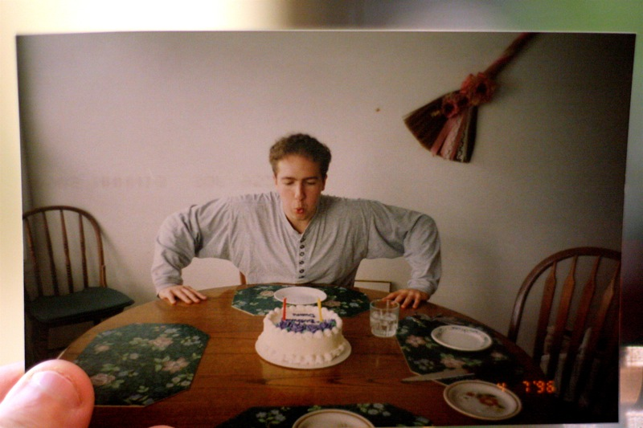

Yes, the rumours are true: today is in fact my birthday. Unlike other years though, I’m purposefully taking this one a bit slower. There are no bar nights planned or anything of that nature, and the highlight of tonight will probably be me eating a nice dinner in front of the TV while catching up on Lost. And that’s the way I wanted it this year.

Last night my dad took me to the Canucks game in Vancouver, and we had a lot of fun. I slept in a bit this morning, a little treat to myself, and am currently at a coffee shop about to do another day of work. Strangely enough, lots of things have already lined up today. My cleaners are coming today, which means I get to have a nice clean apartment tonight. A payment from a magazine in France for an article I wrote months ago finally came through today, which is one less thing I have to worry about it. I just got back from renewing my driver’s license (which is kind of sad, since the day I came back from university after graduating was the day I got the photo on my driver’s license, which I had to replace today). But other than that, today is just another normal day.

Thanks to everyone who wished me a happy birthday in some capacity or another.