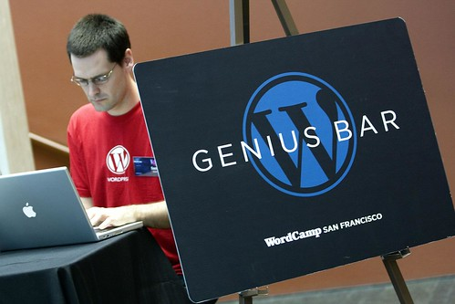

Well, that’s a wrap. WordCamp Vancouver went off yesterday without a hitch, and it seemed to be very well received. It was hard for me not to contrast yesterday’s experience with WordCamp Whistler, since that one was comparable in terms of size and planning. They were both unique, so I can’t say one was better than the other, but they were definitely both a lot of fun.

WordCamp Vancouver was a bit more grass roots than WordCamp Whistler I think, partially because the conference was split between three areas instead of just one. I actually liked that about it, and it was nice to have people wondering around the museum and having their own mini-socials throughout the day.

There were a bunch of highlights for me throughout the weekend:

1\) A couple of the sponsors came up afterwards, excited about the exposure they got and the contacts they made during the event. As an organizer, it’s great to hear that your sponsors found real value in their sponsorship

2\) A couple people came up to me and said they had initial misgivings about the event, but wanted to show up anyways. Everyone I talked to like that seemed to have been won over, learning something new during the conferences, or interacting with new people at the social

3\) Quite a few people commented that the were surprised how much they got for their ticket. Thanks to sponsorship, we were able to provide day-long coffee, pop, muffins, cookies, a full sushi-based lunch, a day long conference with 11 speakers, and a fully paid for social event in Granville Island. Pretty good value if you ask me.

4\) Out of towners. Quite a few people were from out of town. A few people were from Seattle, at least one person from the Okanagan, two people from the Portland area, and my personal favourite, the guy who flew out from Malta (nearly 24 hours of traveling) to be at WordCamp Vancouver.

  
Photo by [John Biehler](http://johnbiehler.com)

It was a great time, and it was awesome hanging out with everyone yesterday. I’m officially glad to be on the other side or WordCamp now, since I’m looking forward to camping and doing a bit of relaxing in the next few weeks. I woke up this morning and only had 3 emails in my Inbox, which is nice compared to the 30 or so I was waking up to in the last few days about the event.

So thanks everyone for coming out, and for making it a great event.