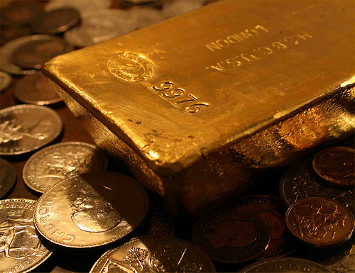

The Gold Standard

Most people don’t realize it, but the current form of printed money we all know and love is actually worthless. While the dollar value on the paper may say $5 or $10, it only holds that relative intrinsic value because each government says it does. There are unfortunately no assets or underlying resources protecting that value, something that has the potential to rapidly destabilize any given currency in the event of an economic or wide-scale crisis.

This type of currency is known as a fiat currency, and it has become the standard in the last 40 years or so. Prior to the conversion to fiat currencies though, most world currencies were backed with an actual equivalent amount of gold. This was known as the [Gold Standard](http://en.wikipedia.org/wiki/Gold_standard).

In principle, I personally think the idea of a Gold Standard makes a lot more sense than currencies backed by government promises. The one unfortunate limitation of using gold as a currency standard is that gold has no real worth on its own, other than a small role in electronics and that of jewelry. Silver and platinum on the other hand have real world uses – silver is the best electrical conductor, and plays a critical role in electronics; platinum is also used in electronics, and is crucial in a lot of chemical processes such as catalytic conversion.

While many people think returning to a Gold Standard would be advantageous (although at this point in time, nearly impossible), the Gold Standard has many detractors. Some students of history think that the Gold Standard prolonged the Great Depression by limiting the steps the Central Bank could take to help stabilize the economy. With a Fiat Currency such as the US Dollar, the Central Bank can control interest rates, which can effectively push money into and out of the economy, giving them some level of control.

The current economic policy in much of the world is based upon the work of John Keynes, and is part of a group of macroeconomic theories called *[Keynesian Economics](http://en.wikipedia.org/wiki/Keynesian_economics)*. John Keynes was actually against the Gold Standard, and suggested the power to print money be put in the hands of private entities such as the Bank of England. This process would naturally lead to inflation, since governments could effectively print money (and devalue the current currency) at will. Keynes pointed out, rightly so, that inflation was actually a way to steal wealth from citizens:

> By a continuous process of inflation, governments can confiscate, secretly and unobserved, an important part of the wealth of their citizens. By this method, they not only confiscate, but they confiscate arbitrarily; and while the process impoverishes many, it actually enriches some.

Partially because the fears of misuse of the printing press on the world stage, the World Bank was created and an agreement was reached between countries to fix the value of the US dollar at $35/ounce of gold, and to fix all other currencies to the US dollar. Effectively this placed an intrinsic value on each currency in relation to a fixed amount of gold. The agreement that governs this was called the [Bretton Woods Agreement](http://en.wikipedia.org/wiki/Bretton_Woods_Agreement).

The Bretton Woods Agreement was an international agreement that gave intrinsic value, based on convertibility into a fixed amount of gold, to many of the world’s more well-used currencies. Unfortunately this made it hard for governments to spend more than they had, which caused problems, especially during times of war. One example of this is the Vietnam War, paid for in part by the printing of additional money by the US Government which naturally led to inflation of the US Dollar on the world market. As the US currency inflated and lost value on the world-stage, many countries began asking the US to honour its promise to convert its dollar into the equivalent amount of gold. Realizing it would be impossible (based on the amount of money that had been printed and the lack of actual physical reserves of gold) to fulfil those obligations, President Nixon suspended the convertibility of paper money into gold on August 15th, 1971, effectively single-handedly ending the Bretton Woods Agreement and the Gold Standard.

This was known throughout the world as the [Nixon Shock](http://en.wikipedia.org/wiki/Nixon_Shock).

Many economists think that the collapse of the Gold Standard led directly to what we witnessed in the US in the last few years, mainly that the instruments involved in the collapse (primarily mortgage backed securities and credit default swaps) were a direct result of the risk introduced into the system after the Nixon Shock and subsequent global abandonment of the Bretton Woods System. Alan Greenspan, the chairman of the Federal Reserve from 1987 to 2006, [discussed the ramifications of returning to the Gold Standard in an article in the Wall Street Journal](http://www.gold-eagle.com/greenspan011098.html) in 1981 (my emphasis below):

> The increasingly numerous proponents of a GOLD STANDARD persuasively argue that budget deficits and large federal borrowings would be difficult to finance under such a standard. Heavy claims against paper dollars cause few technical problems, for the Treasury can legally borrow as many dollars as Congress authorizes.
> 
> But with unlimited dollar conversion into gold, the ability to issue dollar claims would be severely limited. **Obviously if you cannot finance federal deficits, you cannot create them**. Either taxes would then have to be raised and expenditures lowered. The restrictions of gold convertibility would therefore profoundly alter the politics of fiscal policy that have prevailed for half a century.

As it stands we’re stuck with the current fiat currencies, and the fiscal irresponsibility that goes along with them, for the foreseeable future.

Photo by [BullionVault](http://www.flickr.com/people/bullionvault/)