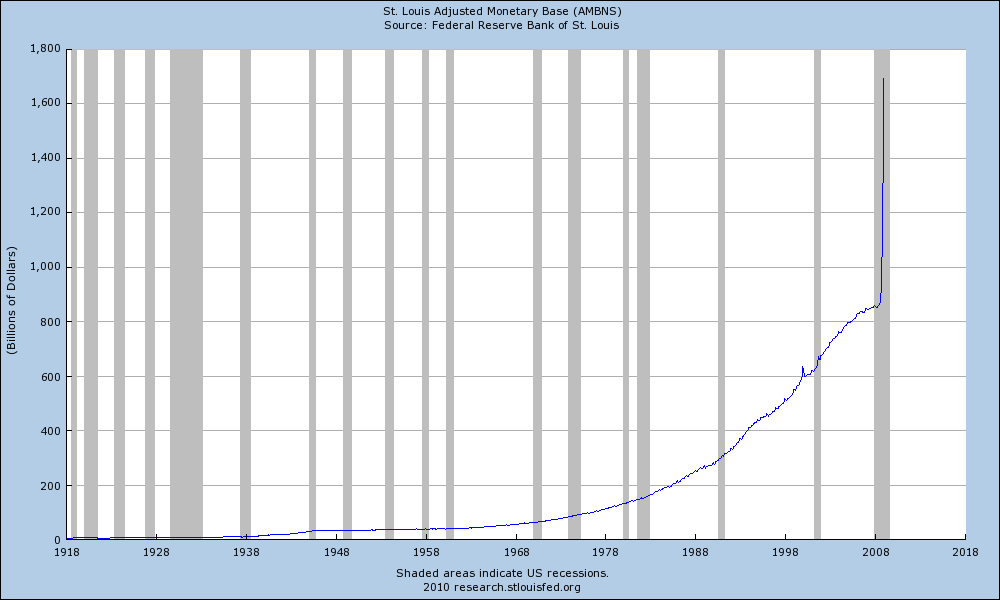

The following graph formed the basis for [Glenn Beck’s video talking about hyperinflation](http://www.youtube.com/watch?v=lNS8IY_Td14), but I thought I would repost it here. Inflation, by definition, is the expansion of the monetary base in a country. While conventionally most people associate rising prices (as measured by the consumer price index – CPI) as inflation, that’s just the symptom of inflation — the root cause in the expansion of the monetary supply.

Most people concede that price increases tend to lag inflation by a year or two. So any inflation of the money supply today probably won’t be felt in terms of prices for another year or so.

This graph represents the United States M0 money supply – basically the amount of bills in circulation plus the amounts in reserve. You can clearly see the inflationary effect of Bush and Obama’s stimulus packages at the end. It’s also worth noting that up until 1971 (when Nixon abruptly ended the convertibility of the US dollar into gold) inflation was very modest.

The reason none of that inflation has been felt in consumer prices yet is that most of it is sitting in the reserve and central bank waiting to be loaned out.