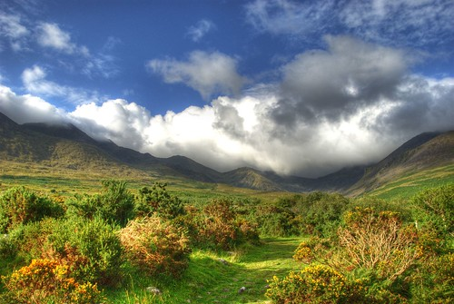

I booked my ticket across the pond tonight. In April of 2011 I’ll be leaving New York City and heading to Shannon, Ireland aboard Continental airlines. My friend [Andy](http://apeatling.wordpress.com/) is living near Shannon with his girlfriend right now (she’s in med school over there), and I told him recently here in Chilliwack that I’d like to come for a visit. So, now it’s official! While I’m not much of a golfer, I’m eager to play a game of golf with Andy in Ireland, for the geography alone.

I really haven’t seen much of Europe. I spent a week in northern Finland at Nokia a few years ago, and had a brief stop over in Helsinki. Other than that, and about 6 hours of time I had in London, I haven’t seen anything else. So my plan is to spend April until June or July bouncing around Europe with a backpack.

My open jaw ticket from Vancouver to Buenos Aires to New York cost me about $1,000, and my flight to Ireland cost me $550. So in total, I’ve spent about $1,550, which is pretty cheap considering that those flights represent about 36 hours of flying and three different continents.

I was pricing out tickets in Europe, and it’s so cheap it’s almost an embarrassment to all North American airlines. For example, a flight from Shannon, Ireland to London costs 5 Euros plus taxes, which works out to about $35 CAD. So rest assured I plan to milk that winged cow all the way across Europe while I’m there.

Countries I’ll definitely visit are Ireland, Britain, Serbia and France. If I get a chance, I’d like to also visit Spain (since I’m hoping my spanish will be pretty good by the time I leave Buenos Aires), Italy, and the Czech Republic. But we’ll see.

Anyways, I’m $1,500 into this already, so there’s no going back now!

Photo by [Michalo](http://www.flickr.com/photos/michalo/1150084174/sizes/m/in/photostream/) on Flickr