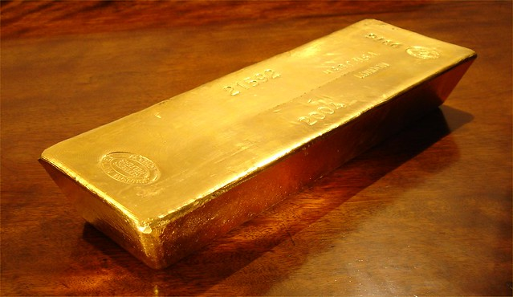

Hard to believe that less than 30 years ago gold was trading at $35/ounce. At that time, the US Dollar was fixed to the price of gold due to an agreement called the Bretton Woods Agreement. That agreement effectively forced countries to back their currencies with gold, which ultimately enforced sound fiscal policies on the participating countries (you can’t spend money you don’t have).

Unfortunately the inability to spend money they didn’t have eventually caused the United States to break out of the BWA: In 1971 Nixon decided to end the convertibility of the US Dollar into gold, which effectively was the same as declaring the United States insolvent. Since that time the Federal Reserve in the US and most of the central banks around the world have engaged in inflationary economics, resorting to printing money to pay off their debts.

Gold (and other precious metals) have historically been used as a hedge against inflation. As an investment vehicle, gold isn’t really very attractive, since it doesn’t really have many commercial usages, other than jewellery. But gold has many of the properties that make it attractive as a currency: it’s durable, malleable, and relatively scarce. For those reasons, gold was used up until this last century as the main backing of most currencies.

That gold has rocketed up from $35 an ounce to $1300 an ounce in just 30 years shows that people have been steadily losing faith in fiat based currencies such as the US and Canadian dollar. If you compare the price of the US Dollar back then to the price of the US Dollar today, you’ll immediately notice that the dollar has lost 98% of its purchasing power since 1971. That is, if you had $35 back then and decided to bury it in your back yard, it would now be worth approximately 70 cents. By comparison, if you had buried an ounce of a gold, it would now be worth $1300 USD. Can you see why people are running, not walking, to precious metals?

Given that the United States effectively doubled their monetary supply with the series of bail outs last year, it’s no surprise that people are flocking into gold and silver at historically high rates. If currencies start crashing (and it’s quite possible that some may), the value of gold will skyrocket even more. Given that the stock market has basically only gone sideways for the last ten years, most people seem to be content with preserving their wealth in the short term as opposed to growing it. That’s why gold is attracting a lot of investors that probably wouldn’t have given it a second though in the old days.

In fact, many people think that gold is a bargain at $1300 an ounce. Based on historical ratios of the price of gold to the DOW Jones Index, gold could conceivably trade at up to $5,000 an ounce by the end of next year. While that would be a rather monumental feat, many people think $1,500 an ounce is a possibility by the end of this year.

Photo by [BullionVault](http://www.flickr.com/photos/bullionvault/) on Flickr