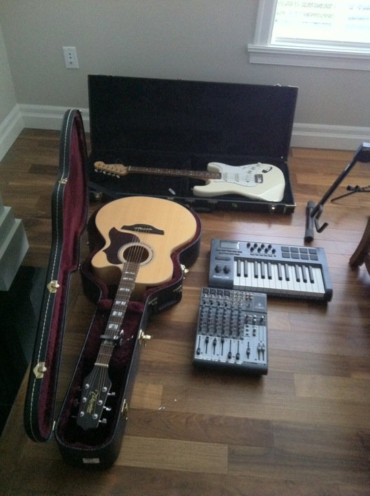
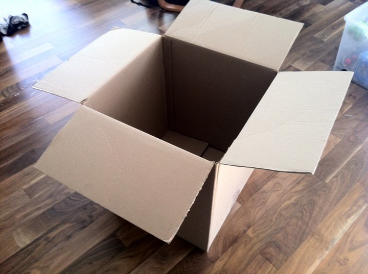

 

I pulled a pile of boxes out of storage today and started the packing process. I don’t technically have to be out of my apartment until the end of November, but my plan is to have a storage facility rented for November 1st. At that point, there’s no reason why I can’t load it up and get most of the big stuff done. I’m also going to be pretty busy in November (I’ll be in Mexico for a week, and have a few weekend activities going on), so I’m not sure how much time I’ll have then to get it all done.

I packed up about 50% of my office today, and the majority of the electronics in my living room. I put a pile of it on craigslist, and hopefully a lot of it will sell. But if not, I have it all ready to go into storage. I sold my LCD TV tonight in about 30 minutes, so I think a lot of the electronics will sell this week.

I have to start placing some calls with some storage facilities this week, but most of them look to be about the same price: around $100 for about 700 cubic feet of storage space in a heated facility. I rented a 350 cubic foot truck to move out to Chilliwack, and my dad had another 100 cubic feet or so in a little utility trailer. So anything over 500 cubic feet of storage is probably enough.

If I get everything in storage early, I may use up some air miles and go visit a few friends of mine in the states for a few weeks. In fact, I wouldn’t mind doing that so I can test out working and lugging my stuff around remotely before I take the plunge by going Argentina.

So, full stream ahead.