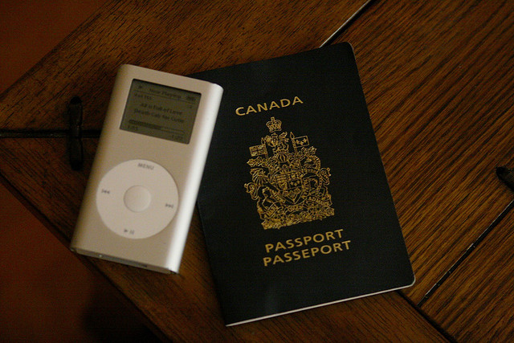

Yesterday morning I woke up to a call from Passport Canada that basically let me know that they didn’t really have a solution to my problem. From their perspective all I had to do was to drive down to Vancouver, show some ID, and pick up my passport. The main obstacle was that Canada Post was saying that they would refuse to release it to me within a government issued ID that has my old address on it.

Despite all that, I figured it was worth a shot anyways, so I packed up some documents that had my old address on them (including a copy of my 2009 tax return, and some T4 slips), and headed into the city. Despite Canada Post’s warnings that they wouldn’t release it to me, I managed to walk away with my passport after just a few minutes. In fact, picking it up was pretty uneventful compared to how dire Canada Post made the situation sound on the phone.

So, problem solved. In 16 days I’ll be heading to Mexico and drinking enough beer to forget about the whole ordeal.