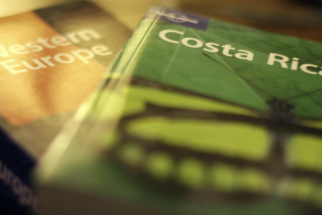

I decided about six weeks ago that I wanted to have a completely different online presence for my travel adventures. While [my personal site](http://www.duanestorey.com) has served me well by allowing me to write about personal subjects and technology over the last few years, it’s become somewhat disjointed. So, with conscious effort I have finally managed to put something together with a specific focus: travel.

Unlike most versions of my website, which normally take all of about two or three days for me to get online, I’ve slowly been tinkering with this one for the past few weeks. I haven’t had a lot of time, so mostly it’s been 20 minutes here and there before bed, but I think this site is far enough along to finally pull the curtain back.

As most people know, I’m about to leave on a big adventure. I’ve spent the last two years living back in my home town, partially to spend some time with my family, and partially to save some money to help get my company off the ground. Given that we’re in no danger of seeing the company explode, I’ve decided to go explore some of the world, while continuing to work as I normally do, remotely.

I’m leaving in January and heading to Buenos Aires for three months. Buenos Aires appeals to me for various reasons.

First, the cost of living is quite a bit cheaper than Canada. The current exchange rate is around 4 Argentine Pesos for Canadian dollar, and most dollar amounts are roughly the same. So, that means you can get a nice steak dinner for $10 CAD, or a bottle of wine for $3 or $4.

Second, I’d really like to take a stab at learning Spanish. I’ve been passively reading Spanish books around here, and I’m hoping it’ll all be driven home after spending three solid months immersed in the language. Given that you can get private Spanish lessons for around $8/hour, I’ll probably do a few hours a week and try to get myself to be somewhat conversational before I leave.

And last, I’m anxious to see what the “Paris of South America” is like. While I’ve traveled a bit with my last job, I haven’t really spent more than week anywhere, so it will be interesting and refreshing to see something new.

I’m currently talking to a few companies about possibly obtaining some partial sponsorship for my trip. While I will be packing light and working as I go, I’ve been featured in enough articles and have enough traffic that I think there would be a great opportunity to work with a few like-minded companies. My Vancouver photography is fairly well known, and I’ve sold enough photographs in my short career that I think I can really bring an interesting and unique perspective to my travels using my photography. If you’re a PR company, or affiliated at all with the travel industry, make sure you check out [my bio](/bio/) and [drop me a line](/contact/) if you think there’s an opportunity to work together.

So, on that note, welcome! I’m looking forward to seeing the world, and sharing my experiences and insights with everyone here. If you have an RSS reader, make sure you [subscribe to the feed](/feed/), and if you’re on Twitter, feel free to [follow the adventure](http://twitter.com/migratorynerd).