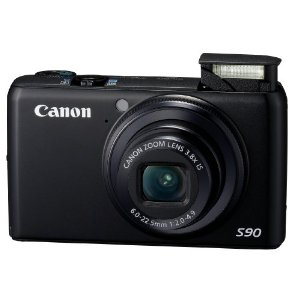
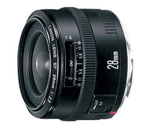

There was a time when I had over $6,000 worth of camera gear sitting in my computer room. I love photography, and having a whole kit full of professional lens is great to have, but it’s not really very practical to lug that much gear around, especially if you’re trying to travel light.

I’ve spent a lot of time over these last few months thinking about what type of camera gear to bring. My first plan was to simply take along a high-end point and shoot camera and make due with that. Given that my old Canon Digital Elph was dying, I went out and bought one of the nicest compact cameras I could find: the [Canon PowerShot S90](http://www.amazon.com/gp/product/B002LITT42?ie=UTF8&tag=duanstor-20&linkCode=as2&camp=1789&creative=9325&creativeASIN=B002LITT42)

The Canon S90 was definitely one of the nicest cameras I saw when I was out looking. It sports a 10MP digital sensor and can handle an ISO of up to 12,800. In addition, the lens is really fast, ringing in at a very impressive f/2.0.

But after buying the Canon S90, I started lamenting the idea of leaving my nice digital SLR at home. Sure, it’s heavy and not really that practical for lugging around, but it takes gorgeous photos. In addition, walking into a pub with a really nice camera is a great way to meet people. In fact, I’ve met a ton of people at pubs and bars, simply by having a nice camera with me. People who are interested in photography will go out of their way to talk to you, and every once and a while you meet a girl who wants to be a model and would like a bit of advice. So, it’s definitely nice conversation starter.

The thought of carrying a bag full of lenses around South America didn’t really appeal to me. So, as a compromise, I decided to bring only one lens with me: the [Canon EF 28mm f/1.8 USM lens](http://www.amazon.com/gp/product/B00009R6WU?ie=UTF8&tag=duanstor-20&linkCode=as2&camp=1789&creative=9325&creativeASIN=B00009R6WU)

Considering my SLR is currently the Canon EOS 40D (which is a crop sensor body), a 28mm lens acts more like a 45mm lens. It’s a bit short for doing normal portraiture, but the perfect size for doing environmental portraiture. Plus, it’s a usable enough focal length that I can use it for walking around and taking photos of buildings and scenery. With a fixed aperture of 1.8, the 28mm lens is also a very usable lens for low-light conditions, such as inside a pub or a coffee shop. So right now, my plan is to spend most of my time traveling with only the 28mm 1.8 lens.

So, in summary, I will be taking the Canon EOS 40D body, a [Canon EF 28mm f/1.8 USM lens](http://www.amazon.com/gp/product/B00009R6WU?ie=UTF8&tag=duanstor-20&linkCode=as2&camp=1789&creative=9325&creativeASIN=B00009R6WU), and a [Canon PowerShot S90](http://www.amazon.com/gp/product/B002LITT42?ie=UTF8&tag=duanstor-20&linkCode=as2&camp=1789&creative=9325&creativeASIN=B002LITT42) camera. In truth, it’s probably excessive given that I’m hoping to only have one backpack, but I really don’t want to leave the SLR at home.