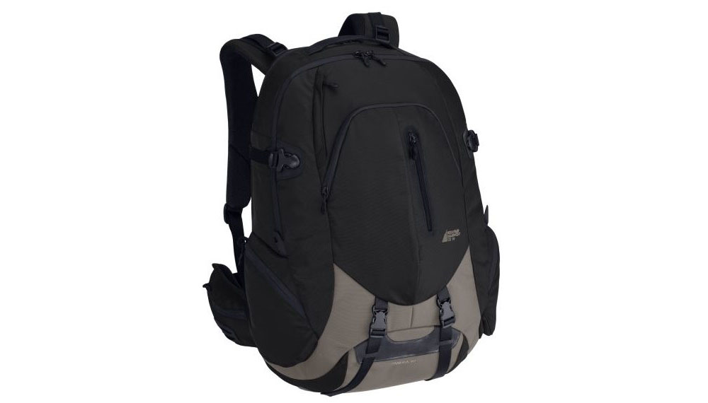
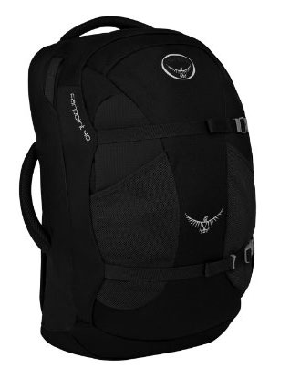

I went down to Mountain Equipment Co-op (MEC) in Vancouver a few weeks ago with the intention of buying a new backpack for travel. While I’ll be living fairly normally in Buenos Aires, I wanted to have a backpack that would allow me to take the occasional weekend trip without carrying too much or too little. Since I have a camera and a laptop, I also wanted a bag which could accommodate both of those, since I know one or two people who have had camera’s stolen from checked baggage over the last few years.

Most travel books I’ve read go out of their way to remind people not to pack too much. Most first-time travellers buy a huge 80 litre backpack and fill it to the brim before setting out. Those same travellers usually have horror stories about dragging that same backpack up 100 stairs, or trying to make it fit on some subway or train. Several authors have even said that their enjoyment on a particular trip was inversely proportional to the amount of things they packed for the trip — that is, the less they brought, the more fun they had.

For me, I think it would be great to simply walk up to an airport with a backpack, and walk right onto the plane without checking in any luggage. Not only do you not have to worry about anything getting lost along the way, but you can plane and deplane in a very short amount of time.

So when I hit MEC, I wanted a bag that had the following characteristics:

- Should fit as carry-on for most airlines
- Should be large enough to carry basic necessities like a few changes of clothes and toiletries
- Should have room for a laptop, my camera and my iPad

There was actually only one backpack at MEC that fit the bill, and that was the MEC Pangea 40, which retails for around $120 CAD (shown in the photo above).

The bag has 40 litres of storage capacity, which essentially makes it like a big day-pack. It’s not the type of bag you would consider for long camping trips, but it should be fine for carrying a week’s worth of clothes, as long as they are rolled up and not very bulky. The bag actually is shaped like a typical carry-on suitcase, which should allow it to be taken aboard most airplanes, at least those in North and South America.

The bag is organized into two large compartments, one of which has a padded laptop sleep, and the other of which is meant for clothes and other personals. The laptop portion rests against your back when the bag is on, which increase the comfort of the bag when it has a laptop inside. I only have a 13″ laptop, which is a nice fit for this bag, but I imagine a 15″ laptop would be a tight squeeze. It seems like some people on the forums have fit a 15″ in it, but I suspect a 17″ is definitely out of the question.

The actual reviews of this bag are a bit mixed – some people really love the bag, and some people really hate it. So I suspect it really depends on what type of traveling you do and what your expectations are. As for me, I think this bag is going to work out really well, and I’m anxious to load it up and try it on my first trip.

### 2013 Update

I travelled to about 15 different countries with the Pangea 40L backpack in 2011 and 2012. All in all this backpack performed admirably, and I was always allowed to bring it with me into the airplane, even on several low-cost carriers such as Air Asia (although I still had to watch the weight limit).

One change I made though was to cut the waist straps off the backpack (as recommended by Duncan in the comments below). It made hardly any functional or cosmetic difference, shaved about 1 lb from the backpack’s weight, and made it less clunky when trying to fit it into the overhead plane on an airplane.

In 2013 I actually bought a newer version of this backpack, but in black and not red. I thought the red looked cool when I first bought it, but now as a seasoned traveller I think the colour simply stands out too much and draws attention to the fact that you are backpacking. The black just seems like any backpack that a kid could have for school, and I much prefer not being singled out as a traveler with this colour, especially when carrying a laptop and camera inside.

### Other Backpacks to Consider

Osprey Farpoint 40 Travel Backpack

My MEC Pangea 40L backpack is great, but unless you are in Vancouver you likely won’t be able to find it. So if you’re looking for a new backpack for travel, here are a few of the bestsellers on Amazon and some of my thoughts on them.

- [The North Face Borealis](http://amzn.to/14SLPjf) – This looks like a great backpack with a built in laptop sleeve (I won’t ever buy a backpack again that can’t easily accommodate a laptop). It’s 29L, which means it’ll definitely fit on carry-on. It might be a tad small though for men if you’re thinking of doing a week-long trip with it, since you won’t be able to fit many clothes. But my 40L is rarely packed to capacity, so it may be large enough for you.
- [Osprey Farpoint 40 Travel Backpack](http://amzn.to/1bEfUVB) – This is about the same size, at least in terms of volume, as my current backpack. It does look slightly longer than mine though, which probably mean it can’t get as wide as mine. It’s advertised that it fits on carry-on as well, and based on my own experiences with my 40L backpack, it should. It also doesn’t look like it has waist straps, which is also good (I think unless you are carrying a bag full of rocks around in this thing that they are totally unnecessary in a backpack this size). It also has a padded laptop and tablet sleeve – so check.

If you have a travel backpack already, drop a comment and let us all know which one it was and how you liked it.