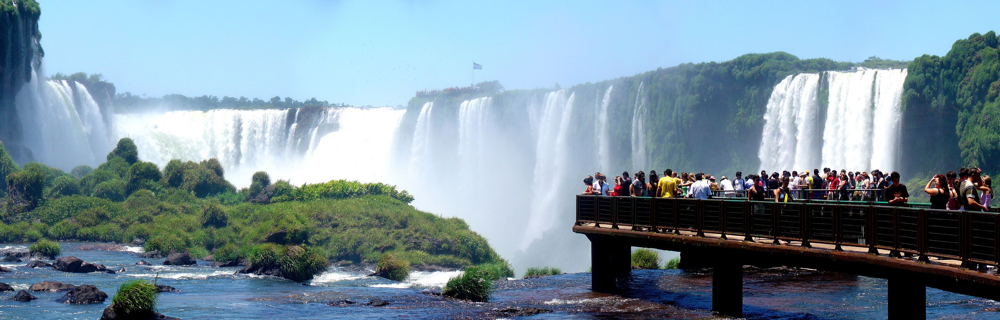

For the most part, I’ll be spending the majority of my time in Argentina around the city of Buenos Aires. While there, I plan to sample as much culture as possible, and hopefully spend some of my down time getting private Spanish lessons.

Near the end of my time in Argentina though, I’m hoping to take a week or two off and actually do a bit of exploring around the country. One of the attractions I’ve been told to not miss is [Iguazu Falls](http://en.wikipedia.org/wiki/Iguazu_Falls), which is located right on border between Brazil and Argentina.

It’s quite the trek from Buenos Aires to the border of Brazil, and I’ll probably have to take an overnight bus trip to get there. But I’ve been told it’s a sight that everyone should go out of their way to see, and I think it would be a fun adventure to travel there and spend a few days taking in the experience.

Apparently there is a walkway that takes a person out towards the falls, and while standing at the end he or she will be surrounded by 260 degrees of waterfall, which would be really amazing. The falls were also featured in the last instalment of the Indiana Jones franchise, *Indiana Jones and the Kingdom of the Crystal Skull*.

Most likely I’ll trek up to the waterfalls sometime near the end of March, which in Argentina will be late summer and hopefully a lot like late spring in Canada in terms of the weather.

Photo by Martin St-Amant on Wikipedia