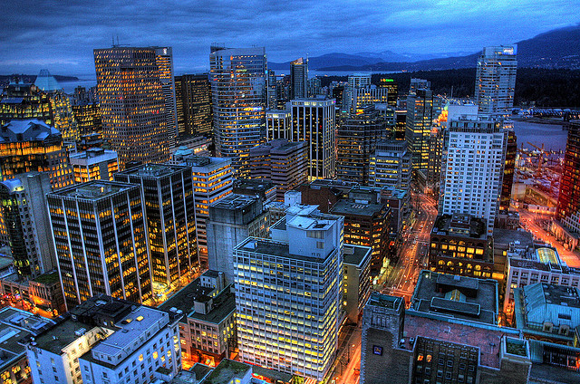

I’m originally from a small little town about 150 kilometres east of Vancouver called Chilliwack. It’s a picturesque farming town nestled between a few mountain ranges, and far enough away from Vancouver to have a little peace and quiet.

And while Chilliwack is my birthplace and where my most of my family lives, I’ve spent nearly a third of my life living in Vancouver, either out at UBC where I did nine years of post secondary education, or in the downtown core, where I’ve worked the majority of my career.

When I set out on my upcoming travel adventure, it’ll be from a familiar place: Vancouver International Airport. While I don’t do as much traveling as I used to, there was a period of time when it felt like I was in the airport all the time, often making quick trips down to the San Francisco Bay area to assist customers. Not all of the trips I took with work were enjoyable, mostly because they involved helping customers on high-pressure projects. But at least I got to see a bit more of the world on someone else’s dime.

So this time around I’m definitely looking forward to doing my first bit of international travel that’s entirely at my schedule and at my pace. And in just a little over two months, that journey will start in Vancouver, pass through Houston, Texas, and ultimately end up in Buenos Aires, Argentina, approximately 22 hours or so after leaving.

Where that trip will ultimately take me is anyone’s guess. Historically I’ve always gotten a bit homesick on most trips, so living out of a backpack will take a bit of getting used to. But the truth is that I’m ready for a new adventure, and am anxious to step outside of my comfort zone to meet new people, try learning new languages, and perhaps making a few new friends along the way.

The short term plan is to hit New York City, and then Ireland. After that, England, France (via the Chunnel), Italy, Spain, Greece, Czech Republic, Germany and probably Serbia. Assuming I’m still having a good time at that point, I’ll probably head over to Asia, down to Australia and New Zealand, and then make one last hop over the the Pacific and head back home, ultimately landing where I started, at Vancouver International.

Only 69 more days to go.