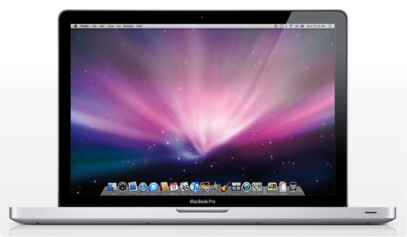
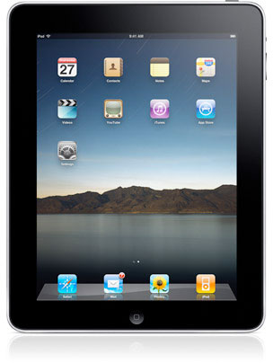
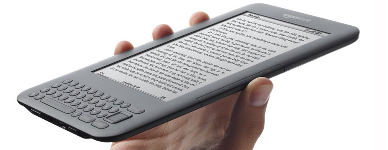

It would be pretty hard to call myself a Migratory Nerd if I wasn’t in fact a pretty big technology nerd. Thankfully, I have enough photography and technological gear around here that it’s pretty easy to describe myself as a nerd.

In a perfect world, I’d be able to bring everything along with me. But given that I want to [travel with a 40L backpack](/2010/carry-on-sized-backpack-to-take-traveling/), I’m not really going to have a ton of room in there.

The following is a list of the technology I’ll be bringing along on my little adventure.

### 13″ Macbook Pro

The idea that people used to once travel the world for months at a time without really being able to contact home seems pretty foreign to me in this day and age. Even five years ago when I was on a fairly remote trip to Costa Rica there was always an internet cafe close by. Today things are even better and one can easily find wireless internet in most coffee shops abroad.

So the first technological toy I will definitely be bringing along is my [13-inch Macbook Pro](http://www.amazon.com/gp/product/B003GSLU3E?ie=UTF8&tag=duanstor-20&linkCode=as2&camp=1789&creative=9325&creativeASIN=B003GSLU3E).Not only will having it around allow me to continuing working from coffee shops as I travel, but it’ll also allow me to keep in touch with my friends and family back home over email, iChat and Skype.

I recently sold my 15″ Macbook Pro and purchased the 13″ version since it’s far more portable and weight a few pounds less than the 15″ laptop. While I’ve heard of people traveling with 15″ and 17″ laptops, I think the small size of the 13″ will make my backpack that much lighter, and allow me to fit a few extra comforts from home into my bag.

### Apple iPhone 4 

I’ve been a loyal iPhone user since the first 3G version came out a few years ago. Without a doubt the iPhone is the most powerful and functional phone ever developed. Not only does it make great phone calls, have full support for the entire Apple Application store, but it also is a full iPod as well, which means I can take my entire music library on the road with me. So needless to say the second item I’ll be bringing along is my [Apple iPhone 4 Smartphone](http://www.amazon.com/gp/product/B0041E16RC?ie=UTF8&tag=duanstor-20&linkCode=as2&camp=1789&creative=9325&creativeASIN=B0041E16RC).

Unlike many places in the world, the iPhone 4 was sold as a completely unlocked version up here in Canada. Despite being $800 CAD, I splurged and purchased the unlocked version, knowing full well that I would be traveling soon. That means I’ll be able to purchase a pay-as-you-go GSM SIM card in every country I visit and be able to make and receive calls without getting charged ridiculous rates for roaming. In addition, I have Skype and another voice over IP (VOIP) client installed on my phone, which means that I can make cheap calls whenever my phone is connected to WiFi.

### Apple iPad

The [Apple iPad](http://www.amazon.com/gp/product/B002C7481G?ie=UTF8&tag=duanstor-20&linkCode=as2&camp=1789&creative=9325&creativeASIN=B002C7481G) is one of the coolest devices I’ve owned in the last few years. I’ve always been a big fan of the iPhone, and the iPad just takes the experience to the next level. While it’s definitely a multi-functional device with many uses, I tend to use it mostly for surfing the web and reading books via the Amazon Kindle application. In fact, I’ve probably read close to twenty new books in the short time that I’ve owned the iPad, which is about nineteen more than I read in the entire year before.

I also think it will probably be nice to leave the Macbook Pro in my apartment or hotel from time to time, and only take the iPad out to a coffee shop to catch up on reading or emails. While the Macbook Pro isn’t super heavy, I think it’s large enough to be a pain from time to time, and also probably a pretty nice target for people looking to steal something from you.

### Amazon Kindle

A lot of people will probably find it weird that I’m taking both an iPad and an [Amazon Kindle](http://www.amazon.com/gp/product/B002FQJT3Q?ie=UTF8&tag=duanstor-20&linkCode=as2&camp=1789&creative=9325&creativeASIN=B002FQJT3Q) with me on my trip. In truth, I will probably use them both for reading, so it definitely is a bit redundant. That said, the iPad is a more flexible device, since it can be used for various applications, email, music and the internet. But one of the major drawbacks I’ve found with the device is that it’s pretty much useless outside in sunlight. Since the first stop on my trip is to South America, the thought of not being able to read from one of my devices outside in the middle of summer is fairly depressing. So not only does the Kindle allow one to read outside consistently, but you can get an extra three weeks worth of use on the Kindle with a single charge compared to the iPad, which makes it that much more compelling as a travel device.

In terms of weight and size, the [Amazon Kindle](http://www.amazon.com/gp/product/B002FQJT3Q?ie=UTF8&tag=duanstor-20&linkCode=as2&camp=1789&creative=9325&creativeASIN=B002FQJT3Q) is extremely small and light, so it’s not going to be taking up very much room in my bag or putting any strain on my backpack.

### Photography Gear

I’ll be bringing along a Canon EOS 40D digital SLR, a Canon EF 28mm f/1.8 lens and a Canon S90 digital camera. You can read more about [the camera gear I’m taking traveling for a year](http://themigratorynerd.com/2010/camera-gear-to-take-traveling/) here.

### Quite The Load!

As you can see, I’m going to be carrying quite a bit of technology with me. Right now my plan is to bring a 40L bag, and without any clothes or toiletries, it’s already starting to seem pretty full with all of this technology. But in this day and age I can’t imagine not traveling with all of them, so I’ll find someway to make it all fit in my bag.