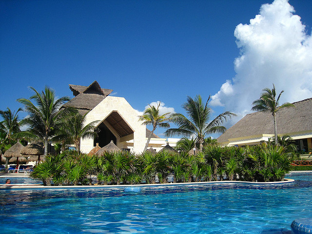

I’m not officially starting my big travel adventure until after Christmas, but decided to go on a little vacation in the meantime. On Friday I’ll be boarding a plane and meeting a friend down in the [Mayan Riviera](http://en.wikipedia.org/wiki/Riviera_Maya) on the east coast of Mexico. I went on a similar trip a year ago and it was a great time.

The resort we’ll be staying at is called the [Bahai Principe Tulum](http://www.tripadvisor.com/Hotel_Review-g499445-d503104-Reviews-Gran_Bahia_Principe_Tulum-Akumal_Yucatan_Peninsula.html), and it’s currently the #2 rated sort in the Akumal region. There are actually three different resorts on the same property, Coba, Akumal and Tulum. Last time we stayed in Akumal, but ended up really liking the pools and the look of the Tulum property. So this time we decided to try the Tulum facility out.

One of the best parts about going back to Mexico is the availability of fresh guacamole. It’s everywhere. At lunch, dinner, breakfast, even an evening snack. For a guy like me that loves nachos, having readily available chips and salsa with fresh guacamole is heavenly. In general I’m a big fan of Mexican food, so I’m sure I’ll get my fill when down at the resort.

The trip is actually a bit of a working vacation, so we’ll be spending about half of our days doing work, usually when it gets super hot outside. But we’ll probably take the mornings and evenings off, either to chill out by the pool or catch whatever shows are going on at the resort. I’ve also never had a chance to head into Playa Del Carmen before, so I’d like to spend a day exploring that if possible.

I’ll be fying out of Vancouver International Airport on Friday, and should be at the resort in the early evening. I’ll definitely post a few updates while I’m down there, so check back in for an update from around the pool next week.