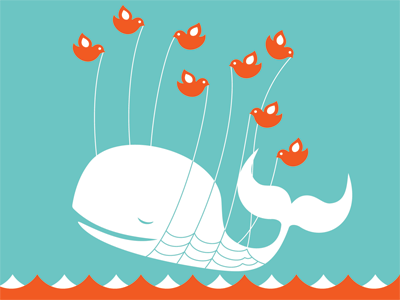

I’ll admit, I don’t get it. It’s been four years now and yet Twitter is pushing forward with an advertising based revenue model (at least, pushing forward via a 3rd party).

I’m not Twitter, and for me to sit on the sidelines and recommend a revenue model for a service I’m not a part of is pretty weak. But that said, I honestly think people would pay for a Pro twitter service if Twitter would simply offer one. I think back to my days in the BBS era when we would all pay $50 (this is back in 1990, so probably more like $100 now) simply to have a (+) next to our BBS name. That’s a form of vanity advertising, but it works. If you’re to be compared against your peers, you don’t want to look cheap. That’s especially true if you have a business.

People can make threats all they want, but we all rely on Twitter for our day to day businesses now and very few people are really going to abandon it. It’s would be like threatening not to fly again because you don’t like the meals on the plane. Oh really? Don’t like the food? Ok then, have fun walking to Europe from now on. It’s a useless threat.

If Twitter came out with a $30/year revenue model similar to Flickr, I’d have a hard time finding anyone I know who I honestly don’t think would eventually pay it. Twitter provides real value, even if that value is limited to finding out where your friends are drinking each night. But many people and businesses get a lot more out of it.

To be honest, after four years I’m a bit surprised we still haven’t seen real revenue models (where people pay for something they genuinely want) out of services such as Twitter and Facebook. Yes, they both do advertising, but I’ve never believed in advertising as a long term strategy, especially in this day and age (where everyone has a PVR and few people care about ads at all). I imagine they are worried that if they start charging money that people will ultimately leave. And that could happen. But what does that say about your service if after a four year trial period your customers still aren’t willing to pay for service?

It says your service isn’t really all that useful, that’s what it says.

**Update:**

Here are a few posts related to Hootsuite, Twitter and advertising.

- [Promoted Tweets – Hootsuite](http://blog.hootsuite.com/promoted-tweets-timelines-twitter/?utm_medium=blog&utm_campaign=blackberry&utm_source=binaries)
- [Dave O. on Vimeo](http://vimeo.com/16410527?utm_medium=blog&utm_campaign=blackberry&utm_source=binaries)