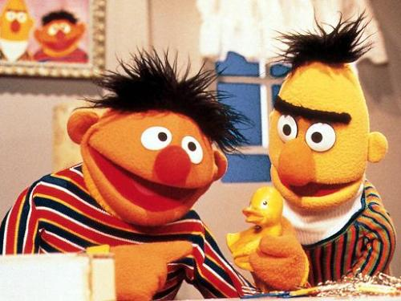

As yes, it’s the subject most guys choose not to talk about. But it’s real, and yes, I unfortunately have a bit of one due to shitty genetics.

If you’re like me and of somewhat European descent you most likely have two eyebrows that like to be together more than they do apart. And that’s fine. Don’t be sad. First, you’re a prime candidate to back Bert and Ernie up on TV. Second, whenever everyone else out there has a cold forehead, you’ll be nice and warm. The first part of recovery is admitting there’s a problem. From there, here are your options.

### The Shave

This is the course of action most guys opt for once they realize they have a monkey growing out of their head. All you need to do is take your straight razor and start plowing fields up around your eyebrows. It works surprisingly well, and will give you almost perfect unibrow camouflage for the first 24 to 36 hours or so, after which you will revert to a hairy pumpkin and not pass go ever again.

### The Pluck

Let’s be honest, guys shouldn’t have to pluck their eyebrows. Unfortunately, for those of you (us) with a unibrow, there aren’t many options. The shave works great in a pinch, but we all need long term solutions. And for that, we need tweezers.

Laugh all you want, because tweezing your eyebrows sucks. But all you guys do it, even the ones who say you don’t. In fact, I know a lot of guys in Vancouver who pay to have it done. That’s fine. I mean, maybe you can’t use Tweezers at home, or you’re allergic to steel or something. But, I can handle them. Fuck, it hurts, but it’s better than having a mink coat grow out of your head so we gotta make due.

### Go Easy

I met an Irishman once who seriously cried when his unibrow was plucked, so seriously, go easy on your man. Going from a position of eyebrow solidarity to one of eyebrow compromise is hard, and not all guys can make it right away. But, rest assured, it’s within the power of all guys to go from a Bert into an Ernie, so just hang tight.