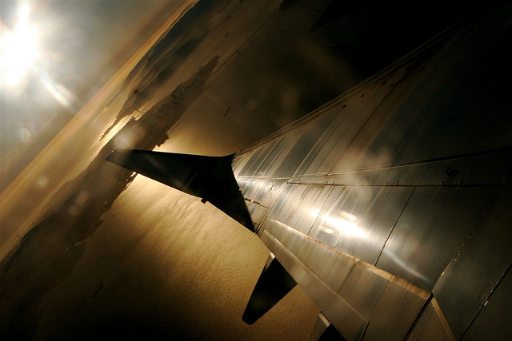

Today is November 4th, and my flight to Buenos Aires leaves on January 4th, 2011. That means there are only 60 days left to go until I depart on my big adventure. It wasn’t that long ago I was doing a post in celebration of 150 days to go, and now here we are at the two month point.

I’m heading to Mexico tomorrow via WestJet in Vancouver. I spent most of last night packing my suitcase and trying to get my apartment as clean as possible in case my landlord decides to show the apartment while I’m gone. In truth, there really isn’t too much more to do in my apartment when I return. Other than the kitchen and a single closet full of hanging clothes, I’m pretty much packed at this point. Which is good, because I’m anxious to get everything into storage when I return.

I return to Vancouver on November 12th and will immediately start packing my kitchen up when I return. I’m hoping to get a few friends over on either 20th or the 27th to put the remaining items into storage. The difference between those two dates really depends on whether or not I get on a plane to go visit some friends in the United States. Either or, it’s not that much longer and then the second Chilliwack chapter of my life will come to a close.

I asked my old house keeper to come back on the 29th and do a final clean for me. She thinks it’ll take about 6 hours to get everything done, which is about $150. It’s a bit more than I want to spend, but I’ll happily pay it so I don’t have to spend an entire day cleaning. Hopefully I’ll arrange for my landlord to come over on the 30th, do the final inspection, and the hand my keys over. My landlord has a $550 security deposit, as well as $200 for the two FOBs I have, so hopefully I get the entire amount back.

I have to say, it’s been really weird boxing everything up, knowing that it could be a year or so until I see some of these items again. I’m not really attached to any of these items, but still, home is home, and my home is almost boxed up.