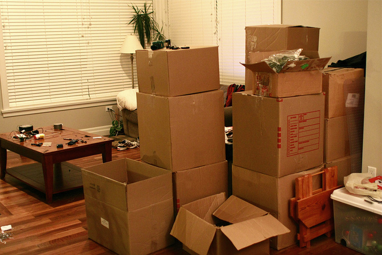

Today marks the two week mark before I’m officially homeless. It’s the first big milestone for my adventure, and I’m looking forward to finally hitting that point. I have about 80% of my apartment boxed up, with only the kitchen to go. I’ll slowly box up the remainder this week, and hopefully start transferring everything into storage next weekend.

Tomorrow my landlord is bringing some people over to look at the place and hopefully rent it out. He hasn’t seen the apartment in about six months, so hopefully he doesn’t find anything wrong with it. I’m counting on getting my full damage deposit back to put as a deposit for my place in Buenos Aires, so I’m going out of my way to make sure there’s no fault when I’m out of here. That’s why I’m also paying for house cleaners to come on the 29th and do one final clean before I hand over the keys on the 30th.

Once I’m out of this apartment I’ll be moving in with my dad and step-mom for December. I’ll probably be bouncing in and out of the city that month, and might even visit some friends in the states, but mostly I’ll be hanging out and preparing to leave at the start of January.

But I’m definitely anxious to finally be out of this apartment and to be starting an exciting new adventure in my life.