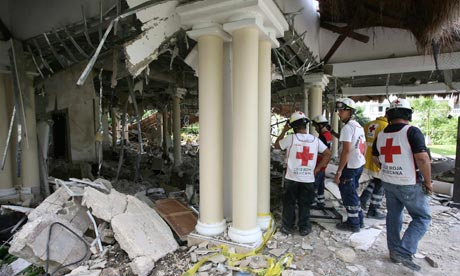

Members of the Red Cross at the hotel. Photograph: Reuters

The first I heard about the explosion today was on Twitter. A friend of mine made mention that she was glad I wasn’t in Mexico anymore as a blast just killed five Canadians staying at a resort down there, as well as two of the hotel staff. I got back home at about 2:30am in the morning on Saturday, so Mexico is still fresh on my mind.

At the resort we were at, Dale and I spent quite a bit of time in the lobby sipping coffee and relaxing. At those resorts, the lobby is typically where people check in and out, and often sit around having a smoke or asking questions of the staff. It sounds like there [was an explosion in the lobby of the Grand Riviera Princess Hotel in Playa del Carmen](http://www.ctv.ca/CTVNews/TopStories/20101114/mexico-hotel-explosion-101114), which is about 20 minutes away from the resort we were at.

It’s not only heart wrenching that five Canadians died from the explosion, but that everyone there was on vacation and simply trying to relax and have a bit of fun for the week. Obviously accidents can happen anywhere (at roughly the same time a car swerved in California and killed five motorcyclists), but it seems all the more tragic given the circumstances.

Many of the Canadians at the resort booked with WestJet Vacations (as did Dale and myself for our trip). To their credit, WestJet has offered grief consoling services to everyone affected, and is also sending in extra planes to remove anyone from the resort who wants to go home early. I imagine many people will want to put the events behind them, and will be opting to head home to continue the grieving and recovery process.

At this point the working theory is that there was a gas build up from a local swamp that ignited and exploded. Several people who saw the explosion said that the floor literally exploded up into the roof, which seems to indicate that the explosion started from beneath the floor. Hopefully investigators will be able to provide some additional answers soon for everyone affected today.