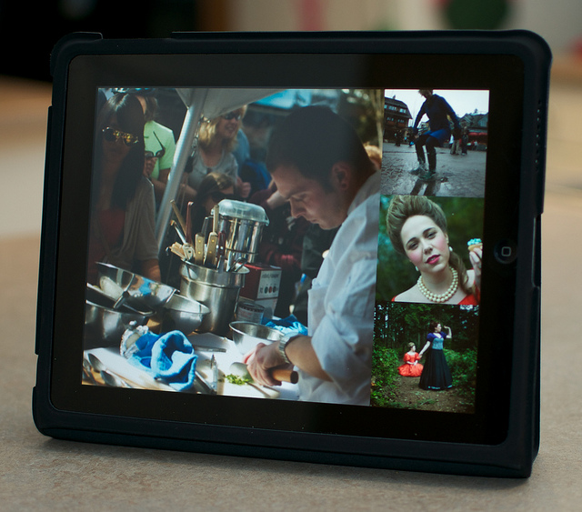

iPad, Photo by John Biehler

My recent trip to Mexico gave me my first real opportunity to use my iPad on a travel adventure. I haven’t really had a lot of time to try watching movies or TV shows on it, and thought it would be fun to try watching a movie on the plane instead of paying for an inflight movie on WestJet.

I loaded my iPad up with Mission Impossible III, Dances with Wolves (I had a copy floating around) and a few new episodes of House. I also made sure I charged the device up to 100% before leaving for the airport.

The first great thing about having the iPad loaded with movies is that you can watch them whenever you want. On WestJet, you basically have to purchase your in-flight entertainment within the first 30 minutes of the flight. If you fail to do that, you’ll be forced to watch satellite TV instead. Satellite TV isn’t too bad, but on international flights (like mine was) the TV disappears once you are outside of Canada. So, if you didn’t pay for a few movies beforehand, you’d probably be stuck staring at the GPS channel for a few hours.

So, I didn’t bother renting anything, and instead whipped my iPad out after about 30 minutes. The two people sitting next to me hadn’t seen one before, so I let them play around with it until I was forced to rip it out of their hands so I could watch a movie.

I watched around 3 hours of movies and TV shows on the flight, and was surprised that my battery only dropped to about 80%. So I definitely could have used it the entire time on a long 10 hour flight as well. I’m not sure if that’s because the device has hardware video decoding or because all the videos are heavily optimized for mobile devices. Either way, it’s pretty awesome that the device will definitely last or an entire flight.

The only downside to watching movies on the iPad was that the people next to me kept leaning over and trying to watch it from time to time. I didn’t really mind, but it’s a bit strange feeling eyes staring over at you while you’re trying to enjoy your movie. It’s even more weird because I had my headphones in and they couldn’t hear the sound. But, when you travel with cool tech gadgets you have to expect it I guess.

So, in summary:

### Great Things About Taking The iPad Traveling

- Really portable
- Super long battery life for watching movies
- Can store a lot of content on it

### Not So Great Things About Taking The iPad Traveling

- People wanting to play with it
- People looking over your shoulder all flight

So, iPad definitely gets two big thumbs up for a travel device.