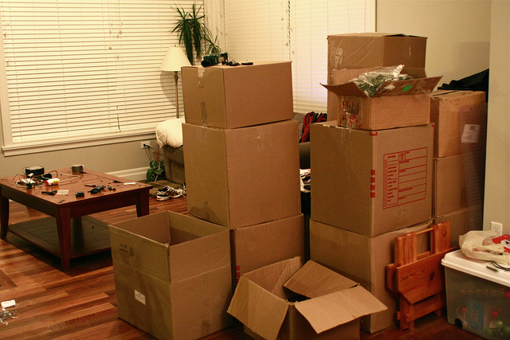

My landlord just stopped by for a visit. He had emailed me while I was down in Mexico and asked if he could bring some people by today, so I said sure. This morning I did a quick clean to make sure the place was presentable, and then set off to a coffee shop to do some work.

Obviously the place wasn’t spotless, since I have a bunch of half packed boxes around and have been in the process of packing for the last few weeks. But most of the bedrooms are empty and the living room basically has a huge pile of boxes in the corner.

So I was a bit surprised when, upon arriving back home, my landlord pulled me aside and told me he thought the place was a disaster. While the hardwood floor needs a cleaning, I had cleaners coming every two weeks for the last year and they only stopped about four weeks ago. I reminded him that he was just here for an inspection not that long ago, and he thought everything was fine then.

He brought the original owners by for a visit, which I wasn’t aware of when he asked me. Since they haven’t seen the apartment since I moved in two years ago (at which point it was brand new), it now has two years of minor wear and tear on it. But nothing out of the ordinary in my opinion.

My landlord actually told me that had I not been moving out he would have written me up for the state of the apartment, which I took offence to considering that I’m in the process of moving and I thought it was unreasonable for him to expect the place to be absolutely spotless when I’m moving most of my things on the upcoming weekend. I also told him I have professional cleaners coming in on the 29th (to the tune of $150, out of my pocket) to make sure everything was spotless.

I suspect that since the owners were here as well he had to try and save a bit of face if it was their expectation that the place was going to be spotless when he arrived. But I was never told the owners were coming or that they needed the place to be spotless.

Anyways, just wanted to vent. Didn’t really expect the outcome that occurred, and have never had problems at previous apartments in similar situations.